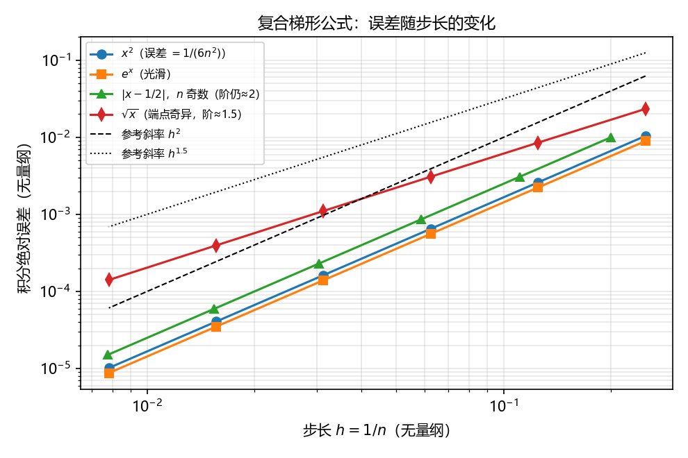
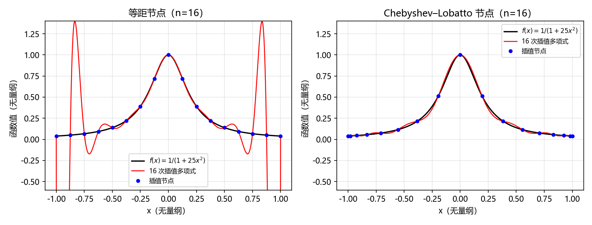
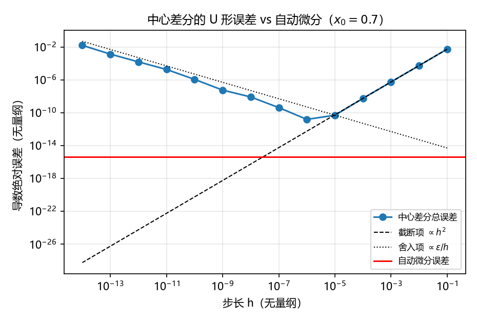

# 第02章 逼近的智慧

*图02-1 · 给弯曲的河岸铺梯形。概念示意，说明"把曲边换成直边再加细"这一想法；不是实测结果，适用条件见第 3、4 节。*

## 先看一幕：给弯曲的河岸铺梯形

弯曲河岸旁的一块地，不方便直接丈量。机器人决定先用小梯形铺一遍，再把每块梯形切细一点：多花一倍功夫，能换来多少精度？

**先猜，再验证：** 对 $\int_0^1 x^2\,dx$，复合梯形公式把区间数从 4 增加到 8，绝对误差会变成原来的几分之一？先写下你的猜想，再与计算对照。

**把故事翻译成数学：** 河岸是情境，数学对象是给定的被积函数 $f$ 与给定的等距网格。"铺梯形"对应在每个小区间上用过两端点的直线代替 $f$；"切细一点"对应把步长 $h$ 减半。比喻不能替代条件：下面会看到，"加细就更准"依赖 $f$ 的光滑性（第 3 节），而"无限加细就无限准"在浮点算术里根本不成立（第 6 节）。

> 状态：A组（实际小组 g02，第1轮）编写稿。本章推导与实验由 A 组完成，数值均取自 [A组-实验.ipynb](A组-实验.ipynb) 的实际运行输出；**B/C 组尚未独立验证**。AI 使用情况见 [A组-AI对话记录.md](A组-AI对话记录.md)，人工核验状态见 [A组-编写报告.md](A组-编写报告.md)。

## 1. 学习目标与前置知识

学完本章，你应当能够：

1. **推导** 等距复合梯形公式在 $f(x)=x^2$、$[0,1]$ 上的**精确**误差 $1/(6n^2)$，并说明它与一般误差界 $O(h^2)$ 的区别。
2. **解释** 为什么"插值多项式在节点上误差为零"不等于"它在整个区间上逼近得好"，并用 Runge 函数给出反例。
3. **比较** 等距节点与 Chebyshev 节点的一致逼近行为，说明节点分布为什么是决定性的。
4. **用网格加密估计收敛阶** $p=\log_2(E_h/E_{h/2})$，并说明光滑性不足时阶**未必**下降（$|x-1/2|$ 仍是 2 阶，$\sqrt{x}$ 才掉到 1.5 阶）。
5. **区分** 有限差分、符号微分与自动微分三者的误差来源，并说明有限差分存在最优步长。

前置知识：Taylor 展开与中值定理、Lagrange 插值的存在唯一性、浮点数的相对精度 $\varepsilon\approx2.22\times10^{-16}$（第 01 章）。

符号约定：区间 $[a,b]$，区间数 $n$，步长 $h=(b-a)/n$，节点 $x_i=a+ih$；$\|g\|_\infty=\max_{x\in[a,b]}|g(x)|$；$E_h$ 表示步长为 $h$ 时的绝对误差。

## 2. 两个不同的目标：插值与逼近

给定 $n+1$ 个节点上的函数值，**插值**要求近似函数在节点处与 $f$ 完全相符：

$$p(x_i)=f(x_i),\qquad i=0,1,\dots,n.$$

**逼近**要求的是另一件事：在某个范数下整体误差小，例如一致逼近（最小化 $\|f-p\|_\infty$）或最小二乘逼近（最小化 $\sum_i (f(x_i)-p(x_i))^2$ 或 $\int (f-p)^2$）。

这两个目标不等价，而且**插值条件对节点之间的行为几乎没有约束**。Weierstrass 定理保证连续函数可以被多项式一致逼近到任意精度，但它说的是"存在这样的多项式"，并不保证"在你选定的节点上插值得到的那个多项式"就是它。第 4 节的 Runge 函数把这两件事的差别摆在数字上。

插值误差有如下标准结果：若 $f\in C^{n+1}[a,b]$，$p_n$ 是 $n+1$ 个节点上的插值多项式，则对每个 $x$ 存在 $\xi\in[a,b]$ 使

$$f(x)-p_n(x)=\frac{f^{(n+1)}(\xi)}{(n+1)!}\prod_{i=0}^{n}(x-x_i).$$

右端有两个因子：**函数自身的高阶导数** $f^{(n+1)}$ 和**只依赖节点位置的** $\prod(x-x_i)$。Runge 现象正是这两个因子一起变坏的结果——节点等距时 $\prod(x-x_i)$ 在区间两端剧烈增大，而 Runge 函数的高阶导数增长得更快。

## 3. 复合梯形公式：一个恒等式与一个误差界

### 3.1 公式

在每个小区间 $[x_{i},x_{i+1}]$ 上用过两端点的直线代替 $f$，面积为 $\frac{h}{2}(f(x_i)+f(x_{i+1}))$。求和并合并相邻项：

$$T_n(f)=h\left[\frac{1}{2}f(x_0)+\sum_{i=1}^{n-1}f(x_i)+\frac{1}{2}f(x_n)\right].$$

### 3.2 对 $f(x)=x^2$ 的精确误差（习题1的推导）

取 $a=0,b=1,h=1/n,x_i=i/n$：

$$T_n=\frac{1}{n}\left[\frac{0}{2}+\sum_{i=1}^{n-1}\frac{i^2}{n^2}+\frac{1}{2}\right]
=\frac{1}{n^3}\cdot\frac{(n-1)n(2n-1)}{6}+\frac{1}{2n}
=\frac{2n^2-3n+1}{6n^2}+\frac{3n}{6n^2}=\frac{2n^2+1}{6n^2}.$$

于是

$$T_n-\int_0^1x^2dx=\frac{2n^2+1}{6n^2}-\frac{1}{3}=\frac{1}{6n^2}.$$

这是**恒等式**，对每个 $n\ge1$ 精确成立，不含"当 $n$ 充分大时"。所以 $n$ 加倍时误差正好变成 $1/4$——这就是开场问题的答案。

### 3.3 一般误差界，以及它要求什么

若 $f\in C^2[a,b]$，则存在 $\xi\in(a,b)$ 使

$$T_n(f)-\int_a^b f=\frac{(b-a)h^2}{12}f''(\xi),\qquad\text{从而}\quad \left|E_h\right|\le\frac{(b-a)h^2}{12}\|f''\|_\infty .$$

对 $f(x)=x^2$，$f''\equiv2$，$b-a=1$，代入得 $|E_h|=h^2/6=1/(6n^2)$，与 3.2 的闭式完全一致。**两条路径给出同一个数，是因为 $f''$ 是常数，中值点 $\xi$ 落在哪里都不影响结果**；对 $f(x)=e^x$ 就不再如此，误差只满足 $E_h\le h^2\|f''\|_\infty/12$ 并渐近于 $O(h^2)$。

由 $E_h\approx Ch^p$ 得到网格加密估计

$$p=\log_2\frac{E_h}{E_{h/2}}.$$

它在两种情况下不可信：一是 $f$ 不够光滑，$C$ 本身随网格变化；二是 $E_h$ 已接近舍入极限，此时 $E_h$ 不再由截断误差主导。

### 3.4 光滑性失效时会怎样（一个被实验推翻的预判）

3.3 的误差公式要求 $f\in C^2$。条件不满足时会发生什么？**我们运行实验前的预判是"观测阶会从 2 掉到约 1"，这个预判被实验推翻了**，下面把过程如实写出。

先取 $f(x)=|x-1/2|$，$\int_0^1 f=1/4$。它连续但在 $x=1/2$ 不可导。实测（第 5 节表 2）：

- $n$ 为**偶数**时 $1/2$ 恰好是节点，误差**恰好为 0**（不是"很小"）；
- $n$ 为**奇数**时折点落在某个小区间内部，误差明显变大，但观测阶仍趋于 2（1.696 → 1.978）。

回头看就清楚了：梯形公式对**分段线性**函数在每个不含折点的小区间上都是精确的。折点落在节点上时整段精确；落在区间内部时，只有**那一个**小区间贡献 $O(h^2)$ 的误差。所以"不满足 $C^2$"并不自动意味着掉阶——变的是常数，不是阶。

要看到真正掉阶，需要更强的奇异性。取 $g(x)=\sqrt{x}$ 在 $[0,1]$，$\int_0^1\sqrt{x}\,dx=2/3$，它在 $x=0$ 处导数无界。理论上复合梯形的误差为 $O(h^{3/2})$，实测观测阶 1.454 → 1.489，趋于 1.5（第 5 节表 2）。

这说明"某个公式是几阶"不是公式单独的属性，而是**公式、函数与网格三者配合**的结果：同样违反 $C^2$，$|x-1/2|$ 保持 2 阶而 $\sqrt{x}$ 掉到 1.5 阶；同一个 $|x-1/2|$，$n=64$ 误差为 0 而 $n=65$ 误差 $5.9\times10^{-5}$。只写"误差很小"的报告完全看不出这些差别。

## 4. 节点分布决定一致逼近

对 Runge 函数 $f(x)=\dfrac{1}{1+25x^2}$，$x\in[-1,1]$：

- **等距节点**：插值多项式在节点上误差为 0（浮点量级），但区间上的最大误差随 $n$ **增大**，在两端附近出现剧烈振荡。
- **Chebyshev–Lobatto 节点** $x_k=\cos(k\pi/n)$：节点在两端更密，区间最大误差随 $n$ **下降**。

原因可以从两方面看。其一是第 2 节误差公式中的节点因子 $\prod(x-x_i)$：等距时它在端点附近很大，而 Chebyshev 节点使 $\max\left|\prod(x-x_i)\right|$ 达到（近似）最小。其二是 Lebesgue 常数 $\Lambda_n=\max_x\sum_i|\ell_i(x)|$，它衡量插值算子的放大倍数，满足

$$\|f-p_n\|_\infty\le(1+\Lambda_n)\,\|f-p_n^\*\|_\infty,$$

其中 $p_n^\*$ 是最佳一致逼近多项式。等距节点的 $\Lambda_n$ 随 $n$ **指数增长**（约 $2^{n}/(e\,n\log n)$），Chebyshev 节点只有 $O(\log n)$ 量级。也就是说：最佳逼近多项式一直存在（Weierstrass），坏的是**我们选择节点的方式**。

**这正是本章第一个 AI 陷阱**：把"节点处残差为零"当作"逼近准确"。这两件事在数字上可以同时是"节点误差 $10^{-15}$"和"区间误差大于 1"。

## 5. 亲手实验：验证开头的猜想

完整代码与输出见 [A组-实验.ipynb](A组-实验.ipynb)。实验前先写下参考值与容差依据，再运行。环境：Python 3.12.10，numpy 1.26.4，scipy 1.14.1，sympy 1.13.3，matplotlib 3.9.2，float64（$\varepsilon=2.22\times10^{-16}$）；全部计算确定性，无随机种子。

**表 1 · 复合梯形公式（实际输出）**

| $n$ | $f(x)=x^2$ 误差 | $1/(6n^2)$ | $g(x)=e^x$ 误差 | $e^x$ 观测阶 |
| --- | --- | --- | --- | --- |
| 4 | 1.042e-02 | 1.042e-02 | 8.940e-03 | — |
| 8 | 2.604e-03 | 2.604e-03 | 2.237e-03 | 1.9989 |
| 16 | 6.510e-04 | 6.510e-04 | 5.593e-04 | 1.9997 |
| 32 | 1.628e-04 | 1.628e-04 | 1.398e-04 | 1.9999 |
| 64 | 4.069e-05 | 4.069e-05 | 3.496e-05 | 2.0000 |
| 128 | 1.017e-05 | 1.017e-05 | 8.740e-06 | 2.0000 |

$x^2$ 一列与 $1/(6n^2)$ 逐项相符：最大绝对偏差 $1.908\times10^{-17}$（断言 `atol=5e-16, rtol=1e-10` 通过）。开场问题的实测：$E_4/E_8=4.000000$，与预测的 4 一致。$e^x$ 的观测阶收敛到 2（断言 `atol=0.02` 通过）。

**关于容差的一条记录：** 最初写的断言是 `rtol=1e-12`，在 $n=128$ 处失败，最大相对偏差 $1.819\times10^{-12}$。失败的原因不是推导错误，而是 $T_n-1/3$ 是两个相近数相减：绝对偏差只有 $1.9\times10^{-17}$（相对 $T_n\approx0.333$ 不到一个 $\varepsilon$），但除以 $E_{128}\approx1.0\times10^{-5}$ 之后，相对判据被抵消放大了约 $|T_n|/|E_n|\approx3\times10^4$ 倍。改用绝对判据 `atol=5e-16` 加宽松的 `rtol=1e-10` 后通过。这是第 01 章抵消误差在本章的一次实际出现，也说明**容差必须按误差的来源来定，不能凭手感**。

**表 2 · 光滑性不足的两种情形（实际输出）**

| 函数 | 情形 | 误差 | 观测阶 |
| --- | --- | --- | --- |
| $\lvert x-1/2\rvert$ | 折点在节点上（$n=64$） | 恰好为 0 | 无法定义（误差为 0） |
| $\lvert x-1/2\rvert$ | 折点在区间内（$n=65$） | 5.917e-05 | 1.696 → 1.978，趋于 **2** |
| $\sqrt{x}$ | 端点导数无界（$n=4\to128$） | 2.338e-02 → 1.410e-04 | 1.454 → 1.489，趋于 **1.5** |

即：$|x-1/2|$ 只是常数变大，阶没有掉；$\sqrt{x}$ 才真正掉到 1.5 阶（断言 `atol=0.05` 通过）。运行前预判的"掉到 1 阶"不成立，已在 3.4 节改正。

*图02-2 · A组实测。双对数坐标，横轴步长 $h=1/n$（无量纲），纵轴积分绝对误差（无量纲）。$x^2$、$e^x$ 与奇数 $n$ 的 $|x-1/2|$ 三条线都与 $h^2$ 参考线平行；只有 $\sqrt{x}$ 与 $h^{1.5}$ 参考线平行。偶数 $n$ 的 $|x-1/2|$ 误差为 0，在对数坐标上无法表示，故未画。*

**表 3 · Runge 函数插值（实际输出，密网格 4001 点）**

| $n$ | 等距：节点上最大误差 | 等距：区间最大误差 | Chebyshev：区间最大误差 |
| --- | --- | --- | --- |
| 4 | 2.728e-14 | 4.384e-01 | 4.600e-01 |
| 8 | 5.376e-14 | 1.045e+00 | 2.047e-01 |
| 12 | 2.139e-12 | 3.663e+00 | 8.440e-02 |
| 16 | 5.743e-11 | 1.439e+01 | 3.671e-02 |
| 20 | 4.956e-10 | 5.982e+01 | 1.774e-02 |

等距节点：节点误差始终在浮点量级，而区间最大误差从 $n=8$ 的 1.045e+00 增长到 $n=20$ 的 5.982e+01。Chebyshev 节点：区间最大误差从 4.600e-01 降到 1.774e-02。

*图02-3 · A组实测，$n=16$。横轴 $x$、纵轴函数值（均无量纲）。两图节点数相同，差别只在节点位置。*

**表 4 · 同节点数下三种做法（实际输出，区间最大误差）**

| 节点数 | 等距高次插值 | 三次样条 | 最小二乘（6 次） |
| --- | --- | --- | --- |
| 9 | 1.045e+00 | 5.615e-02 | 1.797e-01 |
| 17 | 1.439e+01 | 3.745e-03 | 2.310e-01 |
| 21 | 5.982e+01 | 3.183e-03 | 2.314e-01 |

三次样条分段三次、二阶连续，误差 $O(h^4)$ 且不出现全局振荡；最小二乘不要求过节点，适合数据有噪声或点数远多于自由度的场合，但低次拟合对 Runge 函数仍有明显偏差——**"更高次"和"更准"没有必然关系，"过每个点"和"整体像"也没有**。

**表 5 · 三种求导方式（$f(x)=e^{\sin x}\sqrt{1+x^2}$，$x_0=0.7$，实际输出）**

| 方法 | 结果 | 与符号导数之差 |
| --- | --- | --- |
| 符号微分（sympy） | 2.8702119041333467 | — |
| 前向自动微分（对偶数） | 2.8702119041333463 | 4.441e-16 |
| 中心差分，最优 $h=1\times10^{-6}$ | — | 1.570e-11 |
| 中心差分，$h=10^{-13}$ | — | 1.396e-03 |

中心差分的总误差是截断项 $O(h^2)$ 与舍入项 $O(\varepsilon/h)$ 之和，最小值在

$$h^\*\sim(3\varepsilon)^{1/3}\approx6\times10^{-6}$$

附近；实测最优步长 $h=1\times10^{-6}$（相邻的 $10^{-5}$ 误差 $5.092\times10^{-11}$，同一量级），与理论量级一致。$h$ 再小，舍入项反而主导，误差回升——这是第二个 AI 陷阱的实质：**自动微分没有步长，也没有截断误差**，它在计算过程中用链式法则同步传播导数（本章用对偶数 $a+b\epsilon$，$\epsilon^2=0$ 实现），与符号导数一致到 4.441e-16；有限差分只是对导数定义的数值近似。两者机制不同，不是同一件事的两种叫法。

*图02-4 · A组实测。双对数坐标，横轴步长 $h$、纵轴导数绝对误差（均无量纲）。虚线为截断项 $\propto h^2$，点线为舍入项 $\propto\varepsilon/h$，水平红线为自动微分误差。*

## 6. 回到开场：用证据回答

- **最初的预测**：区间数 4 → 8，误差变为 $1/4$。
- **哪一步支持它**：3.2 的闭式推导给出恒等式 $E_n=1/(6n^2)$；表 1 的实测比值 4.000000 与之相符，$E_n$ 与 $1/(6n^2)$ 的最大绝对偏差只有 $1.9\times10^{-17}$。这不是拟合出来的趋势，是可手算核对的等式。
- **结论适用于哪些条件**：$f\in C^2$、等距网格、误差远离舍入极限。条件失效的方式不止一种（表 2）：$|x-1/2|$ 的阶仍是 2，但 $n=64$ 精确、$n=65$ 误差 $5.9\times10^{-5}$，常数完全不同；$\sqrt{x}$ 则真的掉到 1.5 阶，此时"加倍工夫"只换来约 $2^{1.5}\approx2.8$ 倍精度。换成 Runge 函数的高次插值（表 3），"加密节点"甚至让区间误差变大。
- **一处被推翻的预判**：我们原本预期 $|x-1/2|$ 会掉到 1 阶，实验显示并非如此（见 3.4 节的解释）。保留这条记录，是因为"条件不满足"与"阶会下降"之间并没有自动的因果关系。
- **换参数还需验证什么**：非等距/自适应网格、Gauss 求积、更高阶公式在同样奇异性下的表现、多维推广，本章都未做（习题5给出其中一条的入口）。
- **比喻在哪里不再适用**：河岸画面暗示"铺得越细越准"。图02-4 说明，在浮点算术里当步长小到舍入误差主导时，越细越差；画面也无法表达"节点上完全吻合但节点之间可以差得很远"这种情形。

## 7. 小结

1. 插值与逼近是两个不同目标；插值条件只约束节点处。
2. 误差的**阶**由公式、函数光滑性与网格共同决定，不是公式的固有标签；"违反 $C^2$"不等于"掉阶"，要看奇异性有多强。
3. 节点分布可以把同样次数的多项式插值从发散变成收敛（等距 → Chebyshev），根源是 Lebesgue 常数。
4. 求导有三条不同机制：有限差分（有步长、有最优步长）、符号微分（表达式精确、可能膨胀）、自动微分（无步长、按链式法则精确到浮点）。
5. 报告数值必须带上：误差指标定义、容差依据、环境版本、实际输出。

## 8. 课后练习

见 [A组-习题.md](A组-习题.md)，共 4 题加 1 道选做。参考解答在 [A组-习题参考解答.md](A组-习题参考解答.md)，不纳入学生版教材目录。

## 9. 参考资料

以下条目均为可核查来源，对应本章具体主张；AI 给出的说法一律回查原始出处后才写入正文。

1. Burden, R. L., Faires, J. D., Burden, A. M. *Numerical Analysis*, 10th ed., Cengage, 2016. §3.1（Lagrange 插值与误差公式，含节点因子 $\prod(x-x_i)$）、§3.5（三次样条，$O(h^4)$）、§4.3（复合梯形公式与误差 $\frac{(b-a)h^2}{12}f''(\xi)$）。支撑本章第 2、3.3、5 节的公式陈述。
2. Trefethen, L. N. *Approximation Theory and Approximation Practice*, SIAM, 2013. Ch. 5（插值误差与 Lebesgue 常数）、Ch. 13（Runge 现象与 Chebyshev 节点的对比）。支撑第 4 节关于 $\Lambda_n$ 增长率与节点分布的论述。
3. Higham, N. J. *Accuracy and Stability of Numerical Algorithms*, 2nd ed., SIAM, 2002. §1.2 与 Ch. 2（浮点精度、舍入误差与截断误差的权衡）。支撑第 5 节有限差分最优步长的量级分析。
4. Griewank, A., Walther, A. *Evaluating Derivatives: Principles and Techniques of Algorithmic Differentiation*, 2nd ed., SIAM, 2008. Ch. 1–3（前向模式、对偶数、与数值差分的区别）。支撑第 5 节对自动微分机制的说明。
5. Python 3.12 `venv` 文档 <https://docs.python.org/3.12/library/venv.html>；NumPy 1.26 参考 <https://numpy.org/doc/1.26/>；SciPy `CubicSpline` 文档 <https://docs.scipy.org/doc/scipy-1.14.1/reference/generated/scipy.interpolate.CubicSpline.html>。支撑实验环境与所用函数的行为说明。

**待核验说明（B/C 组注意）**：条目 1–4 的章节号由 A 组按版本填写，页码尚未逐条核对到具体印次；请在验证时补全或纠正。条目 2 中 Lebesgue 常数的渐近式 $2^n/(e\,n\log n)$ 为经典结果，A 组未独立重证，只作引用。

## 10. 图片来源与 AI 使用

- 图02-1：仓库初始化时提供的 SVG 概念示意（`ABC共用-图片/A-章节导入.svg`），A 组本轮未修改图形，只重写了图注以区分"概念示意"与"实测结果"。
- 图02-2 至图02-4：A 组用本章 Notebook 的 matplotlib 代码生成，数据即表 1–5 的实际运行结果，可由 Notebook 重跑复现。
- AI 使用：本章正文、实验代码与习题在 Claude Opus 5（Claude Code）辅助下编写，提示词、采纳与拒绝的内容记录在 [A组-AI对话记录.md](A组-AI对话记录.md)；人工核验的完成情况与未完成项见 [A组-编写报告.md](A组-编写报告.md)。**不把 AI 的说法当作来源**：正文引用的每条结论都对应上节的可核查文献或本章可重跑的实验。
