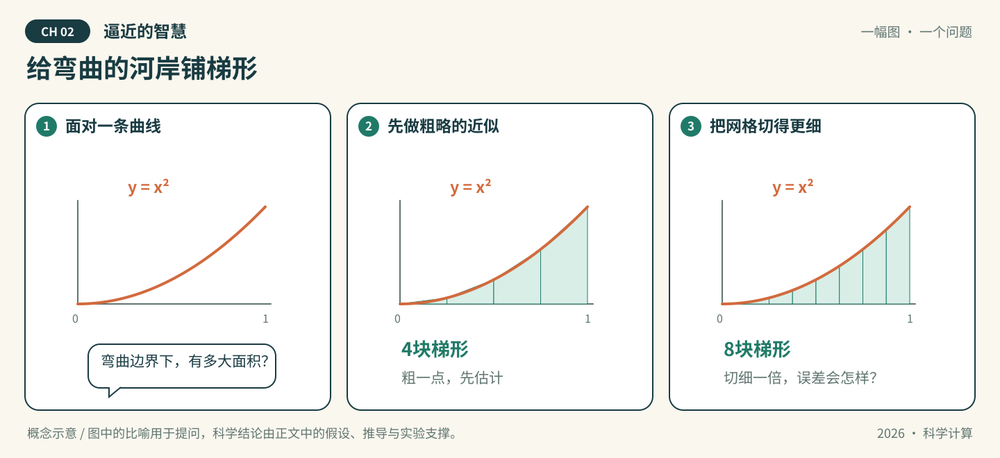

# 第02章 逼近的智慧

*图02-1 · 给弯曲的河岸铺梯形。初始化概念示意；适用条件见下文，不作为实测结果。*

## 先看一幕：给弯曲的河岸铺梯形

弯曲河岸旁的一块地，不方便直接丈量。机器人决定先用小梯形铺一遍，再把每块梯形切细一点：多花一倍功夫，能换来多少精度？

**先猜，再验证：** 对 $\int_0^1 x^2\,dx$，复合梯形公式把区间数从4增加到8，绝对误差会变成原来的几分之一？先画出你的猜想，再与计算对照。

**把故事翻译成数学：** 图中河岸只是面积问题的情境，数学对象是明确给定的函数。这个例子的误差恰为 $1/(6n^2)$，因此区间数加倍时误差为原来的四分之一；一般函数的收敛阶还要核对光滑性等假设。

> 状态：按64学时方案整理的可填写模板，正文、推导和各节完整实验待学生完成。已有漫画与起步代码是初始化材料，不代表学生成果。

**知识主题：** 函数逼近、数值积分与自动微分

**本章核心问题：** 如何用有限的信息逼近一个函数？

**只聚焦三个核心概念：** 插值、最小二乘、自动微分

**先修知识：** 多项式、线性代数、积分、链式法则

**课时：** 4节 × 2学时 = 8学时；全书8章共64学时。

### 本章四节安排

| 节 | 内容 | 学时 |
| --- | --- | --- |
| 2.1 | 插值与Runge现象 | 2 |
| 2.2 | 最小二乘与切比雪夫逼近 | 2 |
| 2.3 | 数值积分与自动微分 | 2 |
| 2.4 | AI关联：神经网络逼近与PINN求导 | 2 |

### 怎么填写本章

从第2.1节开始，把每处“【待填写】”替换为自己的讲解、推导和证据。正文负责连贯讲解；[A组-实验.ipynb](A组-实验.ipynb)按相同节号组织文字与代码，具体实现和实际输出以Notebook为准，正文引用相应小节并解释结果。两处共有的公式、参数和结论须同步。

每节保留“讲解—推导—实验—解释—讨论”，这些是填写栏，不是额外课时。小节内多个方法按提示控制深度；选读不扩大必修范围。

**已有起步实验的位置：** 2.3节。梯形积分的二阶收敛示例属于2.3节；插值、最小二乘和自动微分仍待填写。

---

## 2.1 插值与Runge现象（2学时）

**本节目标：** 能区分节点上的匹配和整个区间的逼近质量。

### 概念讲解：把问题说明白

填写提示：插值问题、节点选择与Runge现象；以多项式插值为主，避免同时铺开全部样条方法。

【待填写】用自己的语言讲解，定义符号、适用范围及先修概念；加入一个自己的例子。

### 关键推导：让结论有依据

推导任务：推导低阶Lagrange插值例子，说明误差项中的光滑性和节点条件。

【待填写】已知条件 → 关键步骤 → 结论 → 条件不满足时的限制。引用定理时写明来源版本和位置。

### 实验设计：先预测，再运行

实验任务：对Runge函数比较等距与Chebyshev节点，在相同节点数下于独立密集网格评估误差。

| 要填写的项目 | 本组内容 |
| --- | --- |
| 要回答的问题与运行前预测 | 待填写 |
| 输入、参数、单位、数据来源与划分 | 待填写 |
| 独立参考解/基线及选择理由 | 待填写 |
| 误差指标、容差及其依据 | 待填写 |
| 环境、种子、设备与运行预算 | 待填写 |

【待填写】在本章Notebook的同号小节编写代码、亲自运行并保存输出。

### 结果解释与本节结论

应提供的证据：提供节点图、插值曲线和区间最大误差；明确区分区间内非节点位置与区间外外推。

【待填写】实际结果是什么？与预测或理论是否一致？不一致的原因是什么？哪些情况尚未验证？图中注明坐标、单位、图例及参数；未运行则写“未运行”。

### 易错点与讨论

待核验的风险：插值节点误差为零不代表区间内或区间外都准确。

【待填写】用推导、反例或真实实验回应这条风险。这里是教学讨论提示，不代表已经观察到某个AI的真实错误。

**随堂提问：** 设计节点数增加却局部误差变大的辨析题，并要求给出数值证据。

【待填写】问题的明确条件、同学可能的回答，以及本组最终解释。

## 2.2 最小二乘与切比雪夫逼近（2学时）

**本节目标：** 能建立最小二乘目标并解释基函数选择的影响。

### 概念讲解：把问题说明白

填写提示：带噪数据拟合、设计矩阵、残差与逼近误差；比较幂基与Chebyshev基，不要求展开极小极大逼近完整理论。

【待填写】用自己的语言讲解，定义符号、适用范围及先修概念；加入一个自己的例子。

### 关键推导：让结论有依据

推导任务：推导最小二乘的一阶最优条件，说明唯一性条件；说明正规方程推导与实际求解方式的区别。

【待填写】已知条件 → 关键步骤 → 结论 → 条件不满足时的限制。引用定理时写明来源版本和位置。

### 实验设计：先预测，再运行

实验任务：固定数据与次数，比较两类基函数拟合；使用lstsq求解并在独立网格评价，记录设计矩阵条件数。

| 要填写的项目 | 本组内容 |
| --- | --- |
| 要回答的问题与运行前预测 | 待填写 |
| 输入、参数、单位、数据来源与划分 | 待填写 |
| 独立参考解/基线及选择理由 | 待填写 |
| 误差指标、容差及其依据 | 待填写 |
| 环境、种子、设备与运行预算 | 待填写 |

【待填写】在本章Notebook的同号小节编写代码、亲自运行并保存输出。

### 结果解释与本节结论

应提供的证据：填写训练残差、独立网格误差与条件数；解释残差更小为何未必泛化更好。

【待填写】实际结果是什么？与预测或理论是否一致？不一致的原因是什么？哪些情况尚未验证？图中注明坐标、单位、图例及参数；未运行则写“未运行”。

### 易错点与讨论

待核验的风险：基于Chebyshev基的最小二乘拟合不能不加条件地称为最优一致逼近。

【待填写】用推导、反例或真实实验回应这条风险。这里是教学讨论提示，不代表已经观察到某个AI的真实错误。

**随堂提问：** 设计一道同数据、同次数、不同基的比较题，要求说明公平比较条件。

【待填写】问题的明确条件、同学可能的回答，以及本组最终解释。

## 2.3 数值积分与自动微分（2学时）

**本节目标：** 能通过求积误差与链式法则区分三种求导途径。

### 概念讲解：把问题说明白

填写提示：以梯形积分作为逼近应用；区分有限差分、符号微分和自动微分，强调自动微分作用于计算过程。

【待填写】用自己的语言讲解，定义符号、适用范围及先修概念；加入一个自己的例子。

### 关键推导：让结论有依据

推导任务：推导x²在[0,1]上的梯形误差；手写一个复合函数的计算图和链式法则。

【待填写】已知条件 → 关键步骤 → 结论 → 条件不满足时的限制。引用定理时写明来源版本和位置。

### 实验设计：先预测，再运行

实验任务：运行现有积分示例，再对同一复合函数比较解析导数、有限差分与自动微分；记录实际使用的自动微分库。

| 要填写的项目 | 本组内容 |
| --- | --- |
| 要回答的问题与运行前预测 | 待填写 |
| 输入、参数、单位、数据来源与划分 | 待填写 |
| 独立参考解/基线及选择理由 | 待填写 |
| 误差指标、容差及其依据 | 待填写 |
| 环境、种子、设备与运行预算 | 待填写 |

【待填写】在本章Notebook的同号小节编写代码、亲自运行并保存输出。

### 结果解释与本节结论

应提供的证据：提交积分收敛表、求导误差及差分步长图；说明自动微分也受浮点运算和实现条件影响。

【待填写】实际结果是什么？与预测或理论是否一致？不一致的原因是什么？哪些情况尚未验证？图中注明坐标、单位、图例及参数；未运行则写“未运行”。

### 易错点与讨论

待核验的风险：有限差分不是自动微分；积分逼近误差与导数计算误差需要分别报告。

【待填写】用推导、反例或真实实验回应这条风险。这里是教学讨论提示，不代表已经观察到某个AI的真实错误。

**随堂提问：** 设计积分加密与复合函数求导两部分的题，分别给出独立参考。

【待填写】问题的明确条件、同学可能的回答，以及本组最终解释。

## 2.4 AI关联：神经网络逼近与PINN求导（2学时）

**本节目标：** 能把网络视作逼近函数，并说明PINN所需的输入导数。

### 概念讲解：把问题说明白

填写提示：小网络函数拟合、参数导数与输入导数；只做PINN求导准备，完整PDE训练放在第6章。

【待填写】用自己的语言讲解，定义符号、适用范围及先修概念；加入一个自己的例子。

### 关键推导：让结论有依据

推导任务：写出小网络的函数表达式，区分对输入x求导和对参数θ求导；讨论激活函数的光滑性。

【待填写】已知条件 → 关键步骤 → 结论 → 条件不满足时的限制。引用定理时写明来源版本和位置。

### 实验设计：先预测，再运行

实验任务：用光滑激活的小网络拟合一个一维函数，在独立网格比较函数值与一、二阶输入导数。

| 要填写的项目 | 本组内容 |
| --- | --- |
| 要回答的问题与运行前预测 | 待填写 |
| 输入、参数、单位、数据来源与划分 | 待填写 |
| 独立参考解/基线及选择理由 | 待填写 |
| 误差指标、容差及其依据 | 待填写 |
| 环境、种子、设备与运行预算 | 待填写 |

【待填写】在本章Notebook的同号小节编写代码、亲自运行并保存输出。

### 结果解释与本节结论

应提供的证据：记录训练点、测试点、种子和导数误差；解释函数拟合好不保证高阶导数同样准确。

【待填写】实际结果是什么？与预测或理论是否一致？不一致的原因是什么？哪些情况尚未验证？图中注明坐标、单位、图例及参数；未运行则写“未运行”。

### 易错点与讨论

待核验的风险：对强形式二阶PDE求导时忽略激活函数光滑性，或将拟合实验称作已求解PDE。

【待填写】用推导、反例或真实实验回应这条风险。这里是教学讨论提示，不代表已经观察到某个AI的真实错误。

**随堂提问：** 设计一道函数值误差与导数误差不一致的分析题。

【待填写】问题的明确条件、同学可能的回答，以及本组最终解释。

## 回到开场：用证据回答

**本章核心问题：** 如何用有限的信息逼近一个函数？

【待填写】先回答漫画提出的具体问题，再连接到本章核心问题。保留原预测，指出支持结论的推导、Notebook小节和实际输出，写明比喻的局限。

## 本章小结与课后习题

围绕 **插值、最小二乘、自动微分** 各写一段：它解决什么问题、适用条件是什么、最容易混淆什么。其他方法说明与这三个概念的联系。

【待填写】本章小结。

课后题按四节对应填写到[A组-习题.md](A组-习题.md)，参考解答单独放在`A组-习题参考解答.md`。

## 选读边界

Monte Carlo和高维积分移出必修主线，仅作为选读；数值积分用一维梯形公式连接逼近与误差。

选读不计入本章8学时和最低完成要求。若添加附录，只在此处填写已有材料的名称和链接，不为了占位增加空文档。

## 参考资料、图片来源与AI使用

| 支撑的主张/公式/图片 | 作者、标题、版本/年份 | 页码/章节/链接 | 本组人工核对 |
| --- | --- | --- | --- |
| 待填写 | 待填写 | 待填写 | 未核对 |

漫画为仓库初始化助手绘制的概念示意，A组需结合最终正文核对并记录修改。AI建议与人工结论分开，本章对话分别记录到`A组-AI对话记录.md`、`B组-AI对话记录.md`、`C组-AI对话记录.md`；A/B/C按轮换角色填写。
