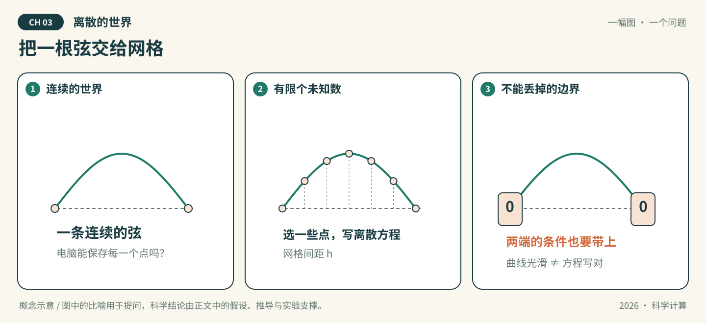

# 第03章 离散的世界

*图03-1 · 把一根弦交给网格。初始化概念示意；适用条件见下文，不作为实测结果。*

## 先看一幕：把一根弦交给网格

机器人想把一条连续的弦装进电脑，只好先保存有限个点。节点越来越密，图像越来越平滑；但如果忘记告诉电脑两端固定在哪里，它画出的弦还是原来那一条吗？

**先猜，再验证：** 在 $-u^{\prime\prime}=\pi^2\sin(\pi x)$ 的离散方程中，$u(0)=u(1)=0$ 如何进入计算？漏掉边界项后，光滑的曲线能否证明问题求解正确？

**把故事翻译成数学：** “弦”是帮助理解连续函数与离散节点的比喻，本章实验求解给定的一维Poisson边值问题。核验对象包括离散符号、边界处理和网格收敛，不能只凭图像平滑或残差小判断正确。

> 状态：按64学时方案整理的可填写模板，正文、推导和各节完整实验待学生完成。已有漫画与起步代码是初始化材料，不代表学生成果。

**知识主题：** 微分方程数值方法：有限差分与有限元

**本章核心问题：** 如何数值求解ODE和PDE？

**只聚焦三个核心概念：** RK4、CFL条件、弱形式

**先修知识：** 常微分方程、偏导数、Taylor展开、积分分部

**课时：** 4节 × 2学时 = 8学时；全书8章共64学时。

### 本章四节安排

| 节 | 内容 | 学时 |
| --- | --- | --- |
| 3.1 | ODE初值问题：Euler与RK4 | 2 |
| 3.2 | PDE有限差分：热传导与CFL条件 | 2 |
| 3.3 | 有限元：弱形式与Galerkin方法 | 2 |
| 3.4 | AI关联：Neural ODE与PINN | 2 |

### 怎么填写本章

从第3.1节开始，把每处“【待填写】”替换为自己的讲解、推导和证据。正文负责连贯讲解；[A组-实验.ipynb](A组-实验.ipynb)按相同节号组织文字与代码，具体实现和实际输出以Notebook为准，正文引用相应小节并解释结果。两处共有的公式、参数和结论须同步。

每节保留“讲解—推导—实验—解释—讨论”，这些是填写栏，不是额外课时。小节内多个方法按提示控制深度；选读不扩大必修范围。

**已有起步实验的位置：** 3.3节。一维Poisson差分制造解例子用作有限元的对照基线；它不是Euler/RK4实验，也不是已实现的有限元装配。

---

## 3.1 ODE初值问题：Euler与RK4（2学时）

**本节目标：** 能实现单步推进并通过步长加密比较精度。

### 概念讲解：把问题说明白

填写提示：初值问题、Euler与经典RK4；区分局部截断误差、全局误差和稳定性。

【待填写】用自己的语言讲解，定义符号、适用范围及先修概念；加入一个自己的例子。

### 关键推导：让结论有依据

推导任务：手写Euler推导与RK4四个阶段，对有解析解的线性ODE手算一步。

【待填写】已知条件 → 关键步骤 → 结论 → 条件不满足时的限制。引用定理时写明来源版本和位置。

### 实验设计：先预测，再运行

实验任务：对y′=-y、y(0)=1实现两种方法，在相同终止时刻比较多个步长，另选较大步长观察稳定性。

| 要填写的项目 | 本组内容 |
| --- | --- |
| 要回答的问题与运行前预测 | 待填写 |
| 输入、参数、单位、数据来源与划分 | 待填写 |
| 独立参考解/基线及选择理由 | 待填写 |
| 误差指标、容差及其依据 | 待填写 |
| 环境、种子、设备与运行预算 | 待填写 |

【待填写】在本章Notebook的同号小节编写代码、亲自运行并保存输出。

### 结果解释与本节结论

应提供的证据：记录终点误差、收敛阶与函数求值次数，说明比较精度时是否匹配计算成本。

【待填写】实际结果是什么？与预测或理论是否一致？不一致的原因是什么？哪些情况尚未验证？图中注明坐标、单位、图例及参数；未运行则写“未运行”。

### 易错点与讨论

待核验的风险：四阶精度不代表任意步长都稳定，也不能把局部误差阶当全局误差阶。

【待填写】用推导、反例或真实实验回应这条风险。这里是教学讨论提示，不代表已经观察到某个AI的真实错误。

**随堂提问：** 设计一步手算加步长加密题，比较Euler与RK4。

【待填写】问题的明确条件、同学可能的回答，以及本组最终解释。

## 3.2 PDE有限差分：热传导与CFL条件（2学时）

**本节目标：** 能把方程、初边值条件和显式时间步长限制一起离散。

### 概念讲解：把问题说明白

填写提示：一维常系数热方程、中心空间差分和前向Euler时间推进；CFL相关限制必须附带具体格式。

【待填写】用自己的语言讲解，定义符号、适用范围及先修概念；加入一个自己的例子。

### 关键推导：让结论有依据

推导任务：推导显式格式及稳定性限制；明确均匀网格、扩散系数为正等假设，解释r=κΔt/Δx²。

【待填写】已知条件 → 关键步骤 → 结论 → 条件不满足时的限制。引用定理时写明来源版本和位置。

### 实验设计：先预测，再运行

实验任务：在零边界和光滑初值下，比较满足与违反该格式稳定性限制的时间步长；以解析解或高精度基线比较。

| 要填写的项目 | 本组内容 |
| --- | --- |
| 要回答的问题与运行前预测 | 待填写 |
| 输入、参数、单位、数据来源与划分 | 待填写 |
| 独立参考解/基线及选择理由 | 待填写 |
| 误差指标、容差及其依据 | 待填写 |
| 环境、种子、设备与运行预算 | 待填写 |

【待填写】在本章Notebook的同号小节编写代码、亲自运行并保存输出。

### 结果解释与本节结论

应提供的证据：记录网格、时间步、边界实现和误差/增长曲线；人为不稳定演示明确预期，不隐藏爆炸现象。

【待填写】实际结果是什么？与预测或理论是否一致？不一致的原因是什么？哪些情况尚未验证？图中注明坐标、单位、图例及参数；未运行则写“未运行”。

### 易错点与讨论

待核验的风险：把某一种热方程格式的限制称为所有PDE通用的CFL公式。

【待填写】用推导、反例或真实实验回应这条风险。这里是教学讨论提示，不代表已经观察到某个AI的真实错误。

**随堂提问：** 给定κ和网格间距，让读者选择时间步并解释稳定性与精度的区别。

【待填写】问题的明确条件、同学可能的回答，以及本组最终解释。

## 3.3 有限元：弱形式与Galerkin方法（2学时）

**本节目标：** 能从一维边值问题写出弱形式并装配线性单元系统。

### 概念讲解：把问题说明白

填写提示：试探空间、检验函数、积分分部和Galerkin近似；以一维Poisson问题贯穿。

【待填写】用自己的语言讲解，定义符号、适用范围及先修概念；加入一个自己的例子。

### 关键推导：让结论有依据

推导任务：从强形式推导弱形式，写明边界项如何处理，并推导线性单元的局部刚度矩阵。

【待填写】已知条件 → 关键步骤 → 结论 → 条件不满足时的限制。引用定理时写明来源版本和位置。

### 实验设计：先预测，再运行

实验任务：保留现有Poisson差分基线，补写有限元装配；用同一制造解比较两种方法并做网格加密。

| 要填写的项目 | 本组内容 |
| --- | --- |
| 要回答的问题与运行前预测 | 待填写 |
| 输入、参数、单位、数据来源与划分 | 待填写 |
| 独立参考解/基线及选择理由 | 待填写 |
| 误差指标、容差及其依据 | 待填写 |
| 环境、种子、设备与运行预算 | 待填写 |

【待填写】在本章Notebook的同号小节编写代码、亲自运行并保存输出。

### 结果解释与本节结论

应提供的证据：给出局部矩阵、边界施加方式、解图和明确定义的误差范数；注明差分与有限元网格/自由度。

【待填写】实际结果是什么？与预测或理论是否一致？不一致的原因是什么？哪些情况尚未验证？图中注明坐标、单位、图例及参数；未运行则写“未运行”。

### 易错点与讨论

待核验的风险：把差分矩阵直接改名为有限元，或积分分部后无理由丢掉边界项。

【待填写】用推导、反例或真实实验回应这条风险。这里是教学讨论提示，不代表已经观察到某个AI的真实错误。

**随堂提问：** 设计一维两单元手动装配题，并用代码核对边界处理。

【待填写】问题的明确条件、同学可能的回答，以及本组最终解释。

## 3.4 AI关联：Neural ODE与PINN（2学时）

**本节目标：** 能区分学习向量场与基于方程残差的训练目标。

### 概念讲解：把问题说明白

填写提示：Neural ODE的右端模型、数值积分器与PINN残差；本节侧重对应关系和最小ODE例子。

【待填写】用自己的语言讲解，定义符号、适用范围及先修概念；加入一个自己的例子。

### 关键推导：让结论有依据

推导任务：分别写出观测拟合目标和方程残差目标，说明初值、参数与求解器误差的角色。

【待填写】已知条件 → 关键步骤 → 结论 → 条件不满足时的限制。引用定理时写明来源版本和位置。

### 实验设计：先预测，再运行

实验任务：用简单ODE生成轨迹，拟合一个小型右端模型，再以独立步长/求解器评估轨迹；完整PDE PINN在第6章完成。

| 要填写的项目 | 本组内容 |
| --- | --- |
| 要回答的问题与运行前预测 | 待填写 |
| 输入、参数、单位、数据来源与划分 | 待填写 |
| 独立参考解/基线及选择理由 | 待填写 |
| 误差指标、容差及其依据 | 待填写 |
| 环境、种子、设备与运行预算 | 待填写 |

【待填写】在本章Notebook的同号小节编写代码、亲自运行并保存输出。

### 结果解释与本节结论

应提供的证据：给出训练时与评估时的时间网格、轨迹误差和初值范围，说明哪些部分使用了已知方程。

【待填写】实际结果是什么？与预测或理论是否一致？不一致的原因是什么？哪些情况尚未验证？图中注明坐标、单位、图例及参数；未运行则写“未运行”。

### 易错点与讨论

待核验的风险：将求解器产生的误差全归给网络，或将拟合一条轨迹称作已学会所有初值问题。

【待填写】用推导、反例或真实实验回应这条风险。这里是教学讨论提示，不代表已经观察到某个AI的真实错误。

**随堂提问：** 设计改变初值或评估步长后重新验证的题。

【待填写】问题的明确条件、同学可能的回答，以及本组最终解释。

## 回到开场：用证据回答

**本章核心问题：** 如何数值求解ODE和PDE？

【待填写】先回答漫画提出的具体问题，再连接到本章核心问题。保留原预测，指出支持结论的推导、Notebook小节和实际输出，写明比喻的局限。

## 本章小结与课后习题

围绕 **RK4、CFL条件、弱形式** 各写一段：它解决什么问题、适用条件是什么、最容易混淆什么。其他方法说明与这三个概念的联系。

【待填写】本章小结。

课后题按四节对应填写到[A组-习题.md](A组-习题.md)，参考解答单独放在`A组-习题参考解答.md`。

## 选读边界

多步方法、ADI和波动方程移出必修主线；有限元限定为一维线性单元，复杂几何作为选读。

选读不计入本章8学时和最低完成要求。若添加附录，只在此处填写已有材料的名称和链接，不为了占位增加空文档。

## 参考资料、图片来源与AI使用

| 支撑的主张/公式/图片 | 作者、标题、版本/年份 | 页码/章节/链接 | 本组人工核对 |
| --- | --- | --- | --- |
| 待填写 | 待填写 | 待填写 | 未核对 |

漫画为仓库初始化助手绘制的概念示意，A组需结合最终正文核对并记录修改。AI建议与人工结论分开，本章对话分别记录到`A组-AI对话记录.md`、`B组-AI对话记录.md`、`C组-AI对话记录.md`；A/B/C按轮换角色填写。
