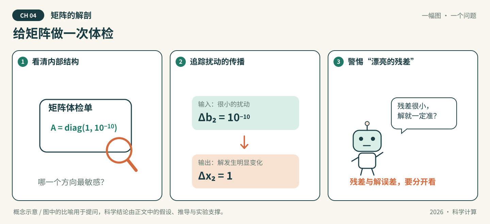

# 第04章 矩阵的解剖

*图04-1 · 给矩阵做一次体检。初始化概念示意；适用条件见下文，不作为实测结果。*

## 先看一幕：给矩阵做一次体检

求解器递来一份漂亮的报告：“残差几乎为零。”矩阵医生却拿起放大镜：如果输入轻轻动一下，解会不会跳很远？

**先猜，再验证：** 设 $A=\operatorname{diag}(1,10^{-10})$。仅把右端第二个分量增加 $10^{-10}$，解的第二个分量会改变多少？这与求解器报告的小残差是否矛盾？

**把故事翻译成数学：** 在这个对角例子中，解的第二分量增加1，二范数条件数为 $10^{10}$。图中体检对应对矩阵结构与扰动敏感性的分析；小残差和小解误差是不同主张，还要说明残差针对哪个右端计算。

> 状态：按64学时方案整理的可填写模板，正文、推导和各节完整实验待学生完成。已有漫画与起步代码是初始化材料，不代表学生成果。

**知识主题：** 线性方程组、特征值与SVD

**本章核心问题：** Ax=b如何高效求解？矩阵的本质结构是什么？

**只聚焦三个核心概念：** LU、CG、SVD

**先修知识：** 矩阵运算、内积、正定性与向量/矩阵范数

**课时：** 4节 × 2学时 = 8学时；全书8章共64学时。

### 本章四节安排

| 节 | 内容 | 学时 |
| --- | --- | --- |
| 4.1 | 直接法：LU与Cholesky | 2 |
| 4.2 | 迭代法：CG与预条件 | 2 |
| 4.3 | 特征值与SVD | 2 |
| 4.4 | AI关联：可微求解器、PCA、LoRA | 2 |

### 怎么填写本章

从第4.1节开始，把每处“【待填写】”替换为自己的讲解、推导和证据。正文负责连贯讲解；[A组-实验.ipynb](A组-实验.ipynb)按相同节号组织文字与代码，具体实现和实际输出以Notebook为准，正文引用相应小节并解释结果。两处共有的公式、参数和结论须同步。

每节保留“讲解—推导—实验—解释—讨论”，这些是填写栏，不是额外课时。小节内多个方法按提示控制深度；选读不扩大必修范围。

**已有起步实验的位置：** 4.3节。小残差与大解误差的对角矩阵示例用于联系奇异值和条件数；不代表已完成LU、CG或AI应用。

---

## 4.1 直接法：LU与Cholesky（2学时）

**本节目标：** 能按矩阵条件选择分解，并解释主元和三角求解。

### 概念讲解：把问题说明白

填写提示：带主元LU、对称正定矩阵的Cholesky、分解复用与多右端求解；避免显式求逆作为默认解法。

【待填写】用自己的语言讲解，定义符号、适用范围及先修概念；加入一个自己的例子。

### 关键推导：让结论有依据

推导任务：手算一个小矩阵的消元与回代，明确置换矩阵约定；写明Cholesky适用条件。

【待填写】已知条件 → 关键步骤 → 结论 → 条件不满足时的限制。引用定理时写明来源版本和位置。

### 实验设计：先预测，再运行

实验任务：用小型一般矩阵及正定矩阵求解，与可信库函数比较；加入需交换主元的例子。

| 要填写的项目 | 本组内容 |
| --- | --- |
| 要回答的问题与运行前预测 | 待填写 |
| 输入、参数、单位、数据来源与划分 | 待填写 |
| 独立参考解/基线及选择理由 | 待填写 |
| 误差指标、容差及其依据 | 待填写 |
| 环境、种子、设备与运行预算 | 待填写 |

【待填写】在本章Notebook的同号小节编写代码、亲自运行并保存输出。

### 结果解释与本节结论

应提供的证据：报告分解关系的误差、残差、已知真解误差及计算量说明。

【待填写】实际结果是什么？与预测或理论是否一致？不一致的原因是什么？哪些情况尚未验证？图中注明坐标、单位、图例及参数；未运行则写“未运行”。

### 易错点与讨论

待核验的风险：任意矩阵都可无主元LU，或对非正定矩阵无条件使用Cholesky。

【待填写】用推导、反例或真实实验回应这条风险。这里是教学讨论提示，不代表已经观察到某个AI的真实错误。

**随堂提问：** 设计需要主元交换的手算题，再讨论是否适用Cholesky。

【待填写】问题的明确条件、同学可能的回答，以及本组最终解释。

## 4.2 迭代法：CG与预条件（2学时）

**本节目标：** 能说明CG的适用条件和预条件改善的对象。

### 概念讲解：把问题说明白

填写提示：对称正定系统、CG迭代、停止准则与简单对角预条件；学习型预条件留到第8章。

【待填写】用自己的语言讲解，定义符号、适用范围及先修概念；加入一个自己的例子。

### 关键推导：让结论有依据

推导任务：从二次能量函数解释CG的搜索方向，写出迭代式及预条件所需条件。

【待填写】已知条件 → 关键步骤 → 结论 → 条件不满足时的限制。引用定理时写明来源版本和位置。

### 实验设计：先预测，再运行

实验任务：对同一正定系统比较CG与对角预条件CG，在相同停止标准下记录迭代次数和实际误差。

| 要填写的项目 | 本组内容 |
| --- | --- |
| 要回答的问题与运行前预测 | 待填写 |
| 输入、参数、单位、数据来源与划分 | 待填写 |
| 独立参考解/基线及选择理由 | 待填写 |
| 误差指标、容差及其依据 | 待填写 |
| 环境、种子、设备与运行预算 | 待填写 |

【待填写】在本章Notebook的同号小节编写代码、亲自运行并保存输出。

### 结果解释与本节结论

应提供的证据：绘制相对残差历史，报告初值、容差、真解误差与预条件成本。

【待填写】实际结果是什么？与预测或理论是否一致？不一致的原因是什么？哪些情况尚未验证？图中注明坐标、单位、图例及参数；未运行则写“未运行”。

### 易错点与讨论

待核验的风险：残差小不一定解误差小；迭代次数少不一定总时间短。

【待填写】用推导、反例或真实实验回应这条风险。这里是教学讨论提示，不代表已经观察到某个AI的真实错误。

**随堂提问：** 设计一题比较有无预条件的收益，并要求计入构造与应用成本。

【待填写】问题的明确条件、同学可能的回答，以及本组最终解释。

## 4.3 特征值与SVD（2学时）

**本节目标：** 能区分两种分解，并用奇异值解释敏感性和低秩近似。

### 概念讲解：把问题说明白

填写提示：特征值的定义与简单幂迭代直观；SVD、秩、条件数和截断近似，以SVD为核心。

【待填写】用自己的语言讲解，定义符号、适用范围及先修概念；加入一个自己的例子。

### 关键推导：让结论有依据

推导任务：手算对角矩阵的特征值和奇异值，说明一般矩阵两者不等同；写出截断SVD误差与所用范数。

【待填写】已知条件 → 关键步骤 → 结论 → 条件不满足时的限制。引用定理时写明来源版本和位置。

### 实验设计：先预测，再运行

实验任务：运行现有敏感性例子，再对小矩阵做不同秩截断，比较保留奇异值与重构误差。

| 要填写的项目 | 本组内容 |
| --- | --- |
| 要回答的问题与运行前预测 | 待填写 |
| 输入、参数、单位、数据来源与划分 | 待填写 |
| 独立参考解/基线及选择理由 | 待填写 |
| 误差指标、容差及其依据 | 待填写 |
| 环境、种子、设备与运行预算 | 待填写 |

【待填写】在本章Notebook的同号小节编写代码、亲自运行并保存输出。

### 结果解释与本节结论

应提供的证据：给出谱/奇异值图、秩与误差表，分别解释扰动放大和信息压缩。

【待填写】实际结果是什么？与预测或理论是否一致？不一致的原因是什么？哪些情况尚未验证？图中注明坐标、单位、图例及参数；未运行则写“未运行”。

### 易错点与讨论

待核验的风险：把非对称矩阵的特征值绝对值普遍当作奇异值，或把低秩重构等同于预测。

【待填写】用推导、反例或真实实验回应这条风险。这里是教学讨论提示，不代表已经观察到某个AI的真实错误。

**随堂提问：** 设计一个区分特征值与奇异值的反例题。

【待填写】问题的明确条件、同学可能的回答，以及本组最终解释。

## 4.4 AI关联：可微求解器、PCA、LoRA（2学时）

**本节目标：** 能说明矩阵方法与学习模型的连接及其边界。

### 概念讲解：把问题说明白

填写提示：可微线性求解、中心化数据的PCA、LoRA的低秩参数增量；重点推导一个连接，其余作图解比较。

【待填写】用自己的语言讲解，定义符号、适用范围及先修概念；加入一个自己的例子。

### 关键推导：让结论有依据

推导任务：在A可逆的条件下，由Ax=b推导微扰关系；写出中心化数据的SVD与主成分的对应。

【待填写】已知条件 → 关键步骤 → 结论 → 条件不满足时的限制。引用定理时写明来源版本和位置。

### 实验设计：先预测，再运行

实验任务：用小矩阵核对求解器梯度与有限差分，并画PCA重构误差；LoRA只要求维度与参数量的小例子。

| 要填写的项目 | 本组内容 |
| --- | --- |
| 要回答的问题与运行前预测 | 待填写 |
| 输入、参数、单位、数据来源与划分 | 待填写 |
| 独立参考解/基线及选择理由 | 待填写 |
| 误差指标、容差及其依据 | 待填写 |
| 环境、种子、设备与运行预算 | 待填写 |

【待填写】在本章Notebook的同号小节编写代码、亲自运行并保存输出。

### 结果解释与本节结论

应提供的证据：记录梯度方向、差分步长、误差及数据是否中心化，给出低秩参数量计算。

【待填写】实际结果是什么？与预测或理论是否一致？不一致的原因是什么？哪些情况尚未验证？图中注明坐标、单位、图例及参数；未运行则写“未运行”。

### 易错点与讨论

待核验的风险：LoRA不等于对预训练权重直接做截断SVD；PCA未中心化会改变解释。

【待填写】用推导、反例或真实实验回应这条风险。这里是教学讨论提示，不代表已经观察到某个AI的真实错误。

**随堂提问：** 设计一道检查AI关于PCA或LoRA描述的题，给出维度和数学依据。

【待填写】问题的明确条件、同学可能的回答，以及本组最终解释。

## 回到开场：用证据回答

**本章核心问题：** Ax=b如何高效求解？矩阵的本质结构是什么？

【待填写】先回答漫画提出的具体问题，再连接到本章核心问题。保留原预测，指出支持结论的推导、Notebook小节和实际输出，写明比喻的局限。

## 本章小结与课后习题

围绕 **LU、CG、SVD** 各写一段：它解决什么问题、适用条件是什么、最容易混淆什么。其他方法说明与这三个概念的联系。

【待填写】本章小结。

课后题按四节对应填写到[A组-习题.md](A组-习题.md)，参考解答单独放在`A组-习题参考解答.md`。

## 选读边界

GMRES、QR迭代和稀疏存储细节移出必修主线；后向误差仅在残差讨论中给出必要定义，完整分析选读。

选读不计入本章8学时和最低完成要求。若添加附录，只在此处填写已有材料的名称和链接，不为了占位增加空文档。

## 参考资料、图片来源与AI使用

| 支撑的主张/公式/图片 | 作者、标题、版本/年份 | 页码/章节/链接 | 本组人工核对 |
| --- | --- | --- | --- |
| LoRA的低秩参数增量（4.4） | Hu等，LoRA: Low-Rank Adaptation of Large Language Models，2021 | [原论文](https://arxiv.org/abs/2106.09685) | 阅读起点；待本组核对具体表述 |
| 待填写 | 待填写 | 待填写 | 未核对 |

漫画为仓库初始化助手绘制的概念示意，A组需结合最终正文核对并记录修改。AI建议与人工结论分开，本章对话分别记录到`A组-AI对话记录.md`、`B组-AI对话记录.md`、`C组-AI对话记录.md`；A/B/C按轮换角色填写。
