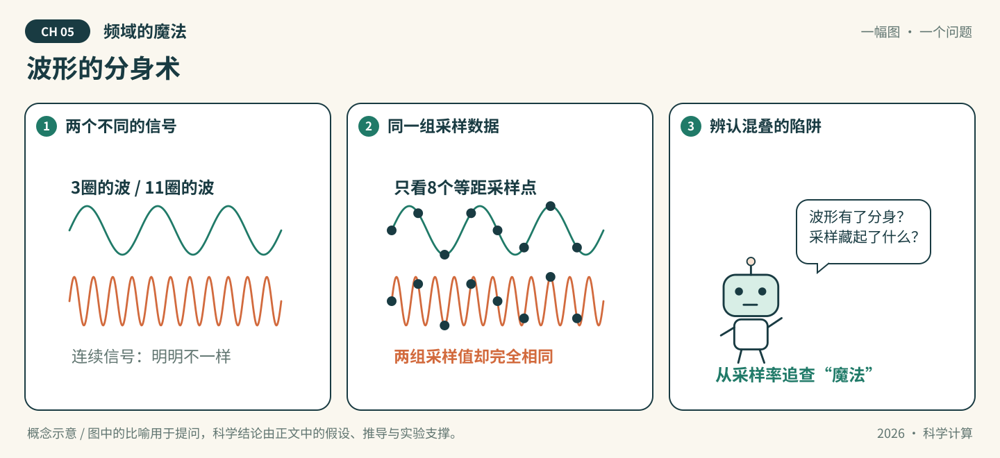

# 第05章 频域的魔法

*图05-1 · 波形的分身术。初始化概念示意；适用条件见下文，不作为实测结果。*

## 先看一幕：波形的分身术

两条波形来参加“身份识别”：一条跑得慢，一条跑得快。机器人只看八次快照，居然给它们贴上了同一个标签。是傅里叶变换失灵，还是快照没有记下全部信息？

**先猜，再验证：** 令 $x_j=2\pi j/8$，$j=0,\ldots,7$。为什么 $\sin(3x_j)$ 与 $\sin(11x_j)$ 一样？这些点相同，能否推出两个连续函数相同？

**把故事翻译成数学：** 因为 $11x_j=3x_j+2\pi j$，两组采样值完全相同，这是混叠的具体例子。图中用8点便于观察；本章起步代码用64点对比频率3与67，原理一致。魔法只是叙事，比对采样率与频率单位才是关键。

> 状态：按64学时方案整理的可填写模板，正文、推导和各节完整实验待学生完成。已有漫画与起步代码是初始化材料，不代表学生成果。

**知识主题：** FFT与谱方法

**本章核心问题：** 如何用频域方法高精度求解PDE？

**只聚焦三个核心概念：** FFT、谱导数、混叠

**先修知识：** 复数、Fourier级数、导数与周期边界

**课时：** 4节 × 2学时 = 8学时；全书8章共64学时。

### 本章四节安排

| 节 | 内容 | 学时 |
| --- | --- | --- |
| 5.1 | DFT与FFT | 2 |
| 5.2 | 谱导数与谱方法 | 2 |
| 5.3 | 混叠与去混叠 | 2 |
| 5.4 | AI关联：FNO与FNet | 2 |

### 怎么填写本章

从第5.1节开始，把每处“【待填写】”替换为自己的讲解、推导和证据。正文负责连贯讲解；[A组-实验.ipynb](A组-实验.ipynb)按相同节号组织文字与代码，具体实现和实际输出以Notebook为准，正文引用相应小节并解释结果。两处共有的公式、参数和结论须同步。

每节保留“讲解—推导—实验—解释—讨论”，这些是填写栏，不是额外课时。小节内多个方法按提示控制深度；选读不扩大必修范围。

**已有起步实验的位置：** 5.2节。现有谱微分和3/67频率混叠示例分别对应5.2与5.3节；去混叠和PDE时间推进仍需学生补齐。

---

## 5.1 DFT与FFT（2学时）

**本节目标：** 能解释频率索引、采样间距和FFT所计算的对象。

### 概念讲解：把问题说明白

填写提示：DFT定义、FFT作为快速算法、正负频率及归一化；区分周频率与角频率。

【待填写】用自己的语言讲解，定义符号、适用范围及先修概念；加入一个自己的例子。

### 关键推导：让结论有依据

推导任务：手算4点DFT，写出逆变换约定，解释采样长度与频率网格的关系。

【待填写】已知条件 → 关键步骤 → 结论 → 条件不满足时的限制。引用定理时写明来源版本和位置。

### 实验设计：先预测，再运行

实验任务：对几个已知频率的周期信号，比较小规模直接DFT与FFT，核对峰值和逆变换。

| 要填写的项目 | 本组内容 |
| --- | --- |
| 要回答的问题与运行前预测 | 待填写 |
| 输入、参数、单位、数据来源与划分 | 待填写 |
| 独立参考解/基线及选择理由 | 待填写 |
| 误差指标、容差及其依据 | 待填写 |
| 环境、种子、设备与运行预算 | 待填写 |

【待填写】在本章Notebook的同号小节编写代码、亲自运行并保存输出。

### 结果解释与本节结论

应提供的证据：记录点数、采样间距、频率单位、幅值归一化与重构误差。

【待填写】实际结果是什么？与预测或理论是否一致？不一致的原因是什么？哪些情况尚未验证？图中注明坐标、单位、图例及参数；未运行则写“未运行”。

### 易错点与讨论

待核验的风险：把FFT频率索引直接当物理频率，或遗漏采样间距与2π因子。

【待填写】用推导、反例或真实实验回应这条风险。这里是教学讨论提示，不代表已经观察到某个AI的真实错误。

**随堂提问：** 设计4点DFT手算及频率轴标注题。

【待填写】问题的明确条件、同学可能的回答，以及本组最终解释。

## 5.2 谱导数与谱方法（2学时）

**本节目标：** 能用频域乘子求导，并说明高精度所依赖的条件。

### 概念讲解：把问题说明白

填写提示：Fourier模态、微分乘子、周期性与光滑性；以一维周期热方程连接PDE求解。

【待填写】用自己的语言讲解，定义符号、适用范围及先修概念；加入一个自己的例子。

### 关键推导：让结论有依据

推导任务：推导一阶、二阶导数乘子，以及热方程各模态的演化；区分空间与时间误差。

【待填写】已知条件 → 关键步骤 → 结论 → 条件不满足时的限制。引用定理时写明来源版本和位置。

### 实验设计：先预测，再运行

实验任务：运行现有谱导数示例，补写周期热方程求解；可采用模态精确时间推进，避免混入未经说明的时间误差。

| 要填写的项目 | 本组内容 |
| --- | --- |
| 要回答的问题与运行前预测 | 待填写 |
| 输入、参数、单位、数据来源与划分 | 待填写 |
| 独立参考解/基线及选择理由 | 待填写 |
| 误差指标、容差及其依据 | 待填写 |
| 环境、种子、设备与运行预算 | 待填写 |

【待填写】在本章Notebook的同号小节编写代码、亲自运行并保存输出。

### 结果解释与本节结论

应提供的证据：记录周期长度、波数构造、导数误差与终时刻解误差，使用解析模态建立参考。

【待填写】实际结果是什么？与预测或理论是否一致？不一致的原因是什么？哪些情况尚未验证？图中注明坐标、单位、图例及参数；未运行则写“未运行”。

### 易错点与讨论

待核验的风险：不光滑或非周期函数不一定有预期的谱收敛；使用FFT不自动保证结果高精度。

【待填写】用推导、反例或真实实验回应这条风险。这里是教学讨论提示，不代表已经观察到某个AI的真实错误。

**随堂提问：** 设计同一函数用周期与不匹配边界处理时的误差比较题。

【待填写】问题的明确条件、同学可能的回答，以及本组最终解释。

## 5.3 混叠与去混叠（2学时）

**本节目标：** 能构造混叠例子，并解释一个去混叠方案的适用场景。

### 概念讲解：把问题说明白

填写提示：离散采样不可区分的频率、非线性乘积产生高频、2/3截断或3/2补零；选一种深入实现。

【待填写】用自己的语言讲解，定义符号、适用范围及先修概念；加入一个自己的例子。

### 关键推导：让结论有依据

推导任务：推导相差整数倍采样频率的模态在网格上重合；用两个模态的乘积解释新频率来源。

【待填写】已知条件 → 关键步骤 → 结论 → 条件不满足时的限制。引用定理时写明来源版本和位置。

### 实验设计：先预测，再运行

实验任务：复用3与67的64点采样例子；针对二次非线性乘积比较未处理与一种去混叠处理，使用足够细网格作参考。

| 要填写的项目 | 本组内容 |
| --- | --- |
| 要回答的问题与运行前预测 | 待填写 |
| 输入、参数、单位、数据来源与划分 | 待填写 |
| 独立参考解/基线及选择理由 | 待填写 |
| 误差指标、容差及其依据 | 待填写 |
| 环境、种子、设备与运行预算 | 待填写 |

【待填写】在本章Notebook的同号小节编写代码、亲自运行并保存输出。

### 结果解释与本节结论

应提供的证据：给出保留模态范围、乘积频谱和误差；说明截断损失的信息及比较网格。

【待填写】实际结果是什么？与预测或理论是否一致？不一致的原因是什么？哪些情况尚未验证？图中注明坐标、单位、图例及参数；未运行则写“未运行”。

### 易错点与讨论

待核验的风险：去混叠并不是从欠采样数据中无条件恢复原来所有高频。

【待填写】用推导、反例或真实实验回应这条风险。这里是教学讨论提示，不代表已经观察到某个AI的真实错误。

**随堂提问：** 设计两条不同连续信号具有相同采样值的题，并讨论能否唯一恢复。

【待填写】问题的明确条件、同学可能的回答，以及本组最终解释。

## 5.4 AI关联：FNO与FNet（2学时）

**本节目标：** 能区分用Fourier变换进行信息混合和学习算子映射。

### 概念讲解：把问题说明白

填写提示：FNO的可学习频域映射与FNet的Fourier混合；只作结构联系，第6章再实现最小神经算子。

【待填写】用自己的语言讲解，定义符号、适用范围及先修概念；加入一个自己的例子。

### 关键推导：让结论有依据

推导任务：用张量维度图说明输入、变换、模态处理和输出；指出哪些参数可学习，哪些只是固定变换。

【待填写】已知条件 → 关键步骤 → 结论 → 条件不满足时的限制。引用定理时写明来源版本和位置。

### 实验设计：先预测，再运行

实验任务：用小型一维输入演示保留模态/固定Fourier混合，比较输入输出形状和信息变化；不要求训练完整FNet。

| 要填写的项目 | 本组内容 |
| --- | --- |
| 要回答的问题与运行前预测 | 待填写 |
| 输入、参数、单位、数据来源与划分 | 待填写 |
| 独立参考解/基线及选择理由 | 待填写 |
| 误差指标、容差及其依据 | 待填写 |
| 环境、种子、设备与运行预算 | 待填写 |

【待填写】在本章Notebook的同号小节编写代码、亲自运行并保存输出。

### 结果解释与本节结论

应提供的证据：提交结构图、维度表和简小计算结果，说明演示与完整模型的差别。

【待填写】实际结果是什么？与预测或理论是否一致？不一致的原因是什么？哪些情况尚未验证？图中注明坐标、单位、图例及参数；未运行则写“未运行”。

### 易错点与讨论

待核验的风险：使用FFT的模型不都叫FNO；FNet并非专为求解PDE定义。

【待填写】用推导、反例或真实实验回应这条风险。这里是教学讨论提示，不代表已经观察到某个AI的真实错误。

**随堂提问：** 设计判断两个Fourier网络示意图中可学习部分及任务差异的题。

【待填写】问题的明确条件、同学可能的回答，以及本组最终解释。

## 回到开场：用证据回答

**本章核心问题：** 如何用频域方法高精度求解PDE？

【待填写】先回答漫画提出的具体问题，再连接到本章核心问题。保留原预测，指出支持结论的推导、Notebook小节和实际输出，写明比喻的局限。

## 本章小结与课后习题

围绕 **FFT、谱导数、混叠** 各写一段：它解决什么问题、适用条件是什么、最容易混淆什么。其他方法说明与这三个概念的联系。

【待填写】本章小结。

课后题按四节对应填写到[A组-习题.md](A组-习题.md)，参考解答单独放在`A组-习题参考解答.md`。

## 选读边界

二维FFT和复杂PDE谱求解移出必修主线；只保留一维周期问题的小规模计算。

选读不计入本章8学时和最低完成要求。若添加附录，只在此处填写已有材料的名称和链接，不为了占位增加空文档。

## 参考资料、图片来源与AI使用

| 支撑的主张/公式/图片 | 作者、标题、版本/年份 | 页码/章节/链接 | 本组人工核对 |
| --- | --- | --- | --- |
| FNO的算子映射与Fourier层（5.4） | Li等，Fourier Neural Operator for Parametric Partial Differential Equations，2020预印本 | [原论文](https://arxiv.org/abs/2010.08895) | 阅读起点；待本组核对具体表述 |
| FNet的固定Fourier混合（5.4） | Lee-Thorp等，FNet: Mixing Tokens with Fourier Transforms，NAACL 2022 | [原论文](https://aclanthology.org/2022.naacl-main.319/) | 阅读起点；待本组核对具体表述 |
| 待填写 | 待填写 | 待填写 | 未核对 |

漫画为仓库初始化助手绘制的概念示意，A组需结合最终正文核对并记录修改。AI建议与人工结论分开，本章对话分别记录到`A组-AI对话记录.md`、`B组-AI对话记录.md`、`C组-AI对话记录.md`；A/B/C按轮换角色填写。
