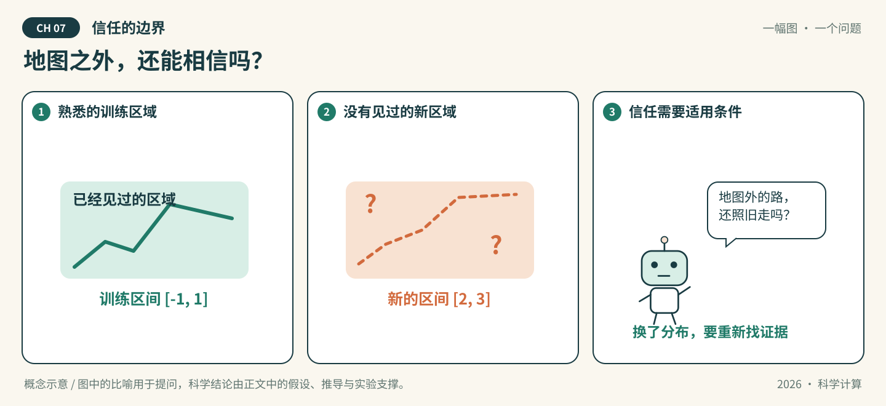

# 第07章 信任的边界

*图07-1 · 地图之外，还能相信吗？初始化概念示意；适用条件见下文，不作为实测结果。*

## 先看一幕：地图之外，还能相信吗？

机器人在熟悉的街区导航得很准。一天，它走出地图覆盖范围，仍然自信地延长路线：熟悉区域里的好表现，究竟能支撑多远的信任？

**先猜，再验证：** 用 $[-1,1]$ 内的数据拟合 $\sin(x)$ 后，为什么仍需单独评估 $[2,3]$ 上的误差？训练误差小，缺少了哪些条件才谈得上域外保证？

**把故事翻译成数学：** 地图是训练域与测试域的比喻，图中的路线不代表测量曲线。本文起步实验是确定性函数外推；统计置信、模型校准与理论误差界需要各自的假设和证据，不能用同一张图互相替代。

> 状态：按64学时方案整理的可填写模板，正文、推导和各节完整实验待学生完成。已有漫画与起步代码是初始化材料，不代表学生成果。

**知识主题：** 泛化、误差界与可信性

**本章核心问题：** 当AI给出一个答案时，我们凭什么相信它？

**只聚焦三个核心概念：** 泛化界、分布外泛化、误差界

**先修知识：** 概率基础、函数逼近、误差度量与训练/测试划分

**课时：** 4节 × 2学时 = 8学时；全书8章共64学时。

### 本章四节安排

| 节 | 内容 | 学时 |
| --- | --- | --- |
| 7.1 | 逼近理论与泛化界 | 2 |
| 7.2 | 分布内与分布外泛化 | 2 |
| 7.3 | 误差界与V&V | 2 |
| 7.4 | AI关联：不确定性量化 | 2 |

### 怎么填写本章

从第7.1节开始，把每处“【待填写】”替换为自己的讲解、推导和证据。正文负责连贯讲解；[A组-实验.ipynb](A组-实验.ipynb)按相同节号组织文字与代码，具体实现和实际输出以Notebook为准，正文引用相应小节并解释结果。两处共有的公式、参数和结论须同步。

每节保留“讲解—推导—实验—解释—讨论”，这些是填写栏，不是额外课时。小节内多个方法按提示控制深度；选读不扩大必修范围。

**已有起步实验的位置：** 7.2节。多项式在域内/域外误差的示例只说明分布改变的风险，不构成一般泛化界，也不是神经网络训练结果。

---

## 7.1 逼近理论与泛化界（2学时）

**本节目标：** 能区分表示能力、训练误差与对未见样本的保证。

### 概念讲解：把问题说明白

填写提示：逼近误差、经验风险、总体风险及泛化界；只选择有限假设类、有界损失等条件清楚的入门例子。

【待填写】用自己的语言讲解，定义符号、适用范围及先修概念；加入一个自己的例子。

### 关键推导：让结论有依据

推导任务：写明所选界的全部假设、样本独立性、置信参数与适用对象；推导关键步骤或逐步解释可信来源。

【待填写】已知条件 → 关键步骤 → 结论 → 条件不满足时的限制。引用定理时写明来源版本和位置。

### 实验设计：先预测，再运行

实验任务：用固定的小模型族和可重复采样问题，观察样本数、训练/测试误差与理论界的关系。

| 要填写的项目 | 本组内容 |
| --- | --- |
| 要回答的问题与运行前预测 | 待填写 |
| 输入、参数、单位、数据来源与划分 | 待填写 |
| 独立参考解/基线及选择理由 | 待填写 |
| 误差指标、容差及其依据 | 待填写 |
| 环境、种子、设备与运行预算 | 待填写 |

【待填写】在本章Notebook的同号小节编写代码、亲自运行并保存输出。

### 结果解释与本节结论

应提供的证据：给出模型族、抽样方式、置信参数和重复试验结果；解释界可能较松及其并非逐样本保证。

【待填写】实际结果是什么？与预测或理论是否一致？不一致的原因是什么？哪些情况尚未验证？图中注明坐标、单位、图例及参数；未运行则写“未运行”。

### 易错点与讨论

待核验的风险：万能逼近定理不保证有限数据可训练性，更不直接保证分布外泛化。

【待填写】用推导、反例或真实实验回应这条风险。这里是教学讨论提示，不代表已经观察到某个AI的真实错误。

**随堂提问：** 设计删除泛化界某项假设后结论是否仍成立的辨析题。

【待填写】问题的明确条件、同学可能的回答，以及本组最终解释。

## 7.2 分布内与分布外泛化（2学时）

**本节目标：** 能按科学任务划分数据，并建立独立的分布外测试。

### 概念讲解：把问题说明白

填写提示：分布内、输入/参数范围改变与分布外；说明训练、验证、测试各自作用。

【待填写】用自己的语言讲解，定义符号、适用范围及先修概念；加入一个自己的例子。

### 关键推导：让结论有依据

推导任务：用数学符号或示意图定义训练与评价分布，说明开场“地图”的比喻在哪里成立。

【待填写】已知条件 → 关键步骤 → 结论 → 条件不满足时的限制。引用定理时写明来源版本和位置。

### 实验设计：先预测，再运行

实验任务：运行现有多项式例子，再比较不同输入区间；针对PDE任务给出按参数或初值划分的方案。

| 要填写的项目 | 本组内容 |
| --- | --- |
| 要回答的问题与运行前预测 | 待填写 |
| 输入、参数、单位、数据来源与划分 | 待填写 |
| 独立参考解/基线及选择理由 | 待填写 |
| 误差指标、容差及其依据 | 待填写 |
| 环境、种子、设备与运行预算 | 待填写 |

【待填写】在本章Notebook的同号小节编写代码、亲自运行并保存输出。

### 结果解释与本节结论

应提供的证据：报告各区间误差与样本范围，图区分拟合区和外推区；不把所有域外输入都预判为失败。

【待填写】实际结果是什么？与预测或理论是否一致？不一致的原因是什么？哪些情况尚未验证？图中注明坐标、单位、图例及参数；未运行则写“未运行”。

### 易错点与讨论

待核验的风险：将同一参数解的网格点随机拆分称作跨参数泛化。

【待填写】用推导、反例或真实实验回应这条风险。这里是教学讨论提示，不代表已经观察到某个AI的真实错误。

**随堂提问：** 设计一个含数据泄漏的划分方案，让读者修正并解释。

【待填写】问题的明确条件、同学可能的回答，以及本组最终解释。

## 7.3 误差界与V&V（2学时）

**本节目标：** 能区分程序是否解对方程与模型是否适合目标用途。

### 概念讲解：把问题说明白

填写提示：Verification与Validation、制造解、网格收敛、残差与解误差；模型验证需对应可信观测及用途。

【待填写】用自己的语言讲解，定义符号、适用范围及先修概念；加入一个自己的例子。

### 关键推导：让结论有依据

推导任务：选择线性系统或简单PDE，推导一个有明确条件的残差/误差关系，指出稳定性常数或条件数的作用。

【待填写】已知条件 → 关键步骤 → 结论 → 条件不满足时的限制。引用定理时写明来源版本和位置。

### 实验设计：先预测，再运行

实验任务：复用前章制造解做代码验证与网格加密；另设计对可信观测的模型验证方案，无真实数据时标明尚未实施。

| 要填写的项目 | 本组内容 |
| --- | --- |
| 要回答的问题与运行前预测 | 待填写 |
| 输入、参数、单位、数据来源与划分 | 待填写 |
| 独立参考解/基线及选择理由 | 待填写 |
| 误差指标、容差及其依据 | 待填写 |
| 环境、种子、设备与运行预算 | 待填写 |

【待填写】在本章Notebook的同号小节编写代码、亲自运行并保存输出。

### 结果解释与本节结论

应提供的证据：分开填写代码验证证据、数学误差界和模型验证证据；合成数据演练不能冒充现实模型有效性。

【待填写】实际结果是什么？与预测或理论是否一致？不一致的原因是什么？哪些情况尚未验证？图中注明坐标、单位、图例及参数；未运行则写“未运行”。

### 易错点与讨论

待核验的风险：残差小不一定解误差小；代码验证通过不代表现实建模已经得到验证。

【待填写】用推导、反例或真实实验回应这条风险。这里是教学讨论提示，不代表已经观察到某个AI的真实错误。

**随堂提问：** 设计区分制造解试验、残差计算和现实观测对比各自作用的题。

【待填写】问题的明确条件、同学可能的回答，以及本组最终解释。

## 7.4 AI关联：不确定性量化（2学时）

**本节目标：** 能评价不确定性表达是否与实际误差和覆盖表现一致。

### 概念讲解：把问题说明白

填写提示：随机性与认知不确定性、预测区间、覆盖率与区间宽度；选一种简单方法，不遍历全部UQ技术。

【待填写】用自己的语言讲解，定义符号、适用范围及先修概念；加入一个自己的例子。

### 关键推导：让结论有依据

推导任务：明确区间构造、校准样本用途与适用假设；区分预测区间与参数置信区间。

【待填写】已知条件 → 关键步骤 → 结论 → 条件不满足时的限制。引用定理时写明来源版本和位置。

### 实验设计：先预测，再运行

实验任务：用小规模回归问题构造区间，在独立测试集统计覆盖率与宽度，并另做域外评价。

| 要填写的项目 | 本组内容 |
| --- | --- |
| 要回答的问题与运行前预测 | 待填写 |
| 输入、参数、单位、数据来源与划分 | 待填写 |
| 独立参考解/基线及选择理由 | 待填写 |
| 误差指标、容差及其依据 | 待填写 |
| 环境、种子、设备与运行预算 | 待填写 |

【待填写】在本章Notebook的同号小节编写代码、亲自运行并保存输出。

### 结果解释与本节结论

应提供的证据：记录样本数、标称覆盖率、实测覆盖率及误差；讨论有限样本波动和分布改变的影响。

【待填写】实际结果是什么？与预测或理论是否一致？不一致的原因是什么？哪些情况尚未验证？图中注明坐标、单位、图例及参数；未运行则写“未运行”。

### 易错点与讨论

待核验的风险：把模型输出的置信数值直接解释为真实正确率，或假设域内校准在域外仍自动成立。

【待填写】用推导、反例或真实实验回应这条风险。这里是教学讨论提示，不代表已经观察到某个AI的真实错误。

**随堂提问：** 设计两个模型覆盖率相近但区间宽度不同的比较题。

【待填写】问题的明确条件、同学可能的回答，以及本组最终解释。

## 回到开场：用证据回答

**本章核心问题：** 当AI给出一个答案时，我们凭什么相信它？

【待填写】先回答漫画提出的具体问题，再连接到本章核心问题。保留原预测，指出支持结论的推导、Notebook小节和实际输出，写明比喻的局限。

## 本章小结与课后习题

围绕 **泛化界、分布外泛化、误差界** 各写一段：它解决什么问题、适用条件是什么、最容易混淆什么。其他方法说明与这三个概念的联系。

【待填写】本章小结。

课后题按四节对应填写到[A组-习题.md](A组-习题.md)，参考解答单独放在`A组-习题参考解答.md`。

## 选读边界

PAC-Bayes和形式化验证移出必修主线；仅选一个假设可讲清的简单泛化界与一个误差估计例子。

选读不计入本章8学时和最低完成要求。若添加附录，只在此处填写已有材料的名称和链接，不为了占位增加空文档。

## 参考资料、图片来源与AI使用

| 支撑的主张/公式/图片 | 作者、标题、版本/年份 | 页码/章节/链接 | 本组人工核对 |
| --- | --- | --- | --- |
| 待填写 | 待填写 | 待填写 | 未核对 |

漫画为仓库初始化助手绘制的概念示意，A组需结合最终正文核对并记录修改。AI建议与人工结论分开，本章对话分别记录到`A组-AI对话记录.md`、`B组-AI对话记录.md`、`C组-AI对话记录.md`；A/B/C按轮换角色填写。
