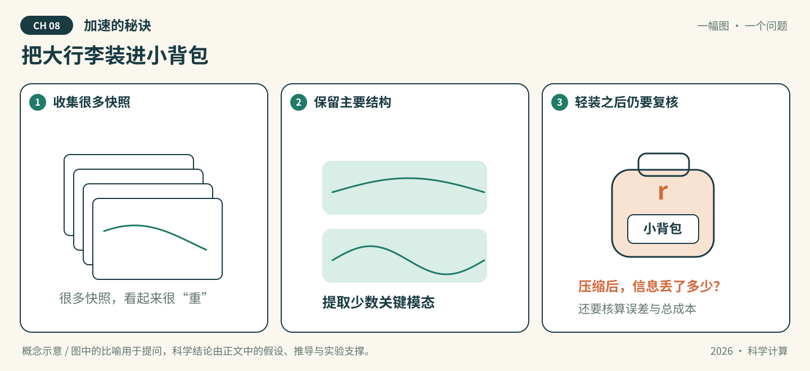

# 第08章 加速的秘诀

*图08-1 · 把大行李装进小背包。初始化概念示意；适用条件见下文，不作为实测结果。*

## 先看一幕：把大行李装进小背包

出发前，机器人把一大箱相似的快照装进背包。与其每张都带，不如挑出少数“共同形状”？背包轻了，但丢掉的信息会不会正好是下一段旅程需要的？

**先猜，再验证：** 用前 $r$ 个POD模态重构快照矩阵时，截断误差怎样由奇异值计算？训练快照重构得好，为什么还不能直接宣称新参数预测准确或总成本更低？

**把故事翻译成数学：** 背包对应低维表示，模态来自给定快照矩阵的SVD。本章起步例子具有秩二结构；推广时必须分别报告截断误差、独立预测误差，以及离线和在线计算成本。

> 状态：按64学时方案整理的可填写模板，正文、推导和各节完整实验待学生完成。已有漫画与起步代码是初始化材料，不代表学生成果。

**知识主题：** 学习型预条件子与降阶模型

**本章核心问题：** 如何用AI加速传统方法的瓶颈环节？

**只聚焦三个核心概念：** 学习型预条件子、自编码器降阶、时间预测

**先修知识：** 第4章CG/SVD、第3章时间推进、基础网络训练

**课时：** 4节 × 2学时 = 8学时；全书8章共64学时。

### 本章四节安排

| 节 | 内容 | 学时 |
| --- | --- | --- |
| 8.1 | 学习型预条件子 | 2 |
| 8.2 | POD与自编码器降阶 | 2 |
| 8.3 | 时间预测：LSTM与Neural ODE | 2 |
| 8.4 | AI关联：数字孪生与算子推断 | 2 |

### 怎么填写本章

从第8.1节开始，把每处“【待填写】”替换为自己的讲解、推导和证据。正文负责连贯讲解；[A组-实验.ipynb](A组-实验.ipynb)按相同节号组织文字与代码，具体实现和实际输出以Notebook为准，正文引用相应小节并解释结果。两处共有的公式、参数和结论须同步。

每节保留“讲解—推导—实验—解释—讨论”，这些是填写栏，不是额外课时。小节内多个方法按提示控制深度；选读不扩大必修范围。

**已有起步实验的位置：** 8.2节。现有POD快照重构只覆盖线性压缩基线；自编码器、学习型预条件和未见时刻预测均待补充。

---

## 8.1 学习型预条件子（2学时）

**本节目标：** 能明确学习模块如何进入迭代求解，并计算实际收益。

### 概念讲解：把问题说明白

填写提示：沿用CG和传统预条件基线，学习矩阵族到预条件参数的映射；讨论正定性和训练范围。

【待填写】用自己的语言讲解，定义符号、适用范围及先修概念；加入一个自己的例子。

### 关键推导：让结论有依据

推导任务：写出预条件矩阵的参数化及保证求解器适用条件的方式，解释训练目标与求解收益之间的关系。

【待填写】已知条件 → 关键步骤 → 结论 → 条件不满足时的限制。引用定理时写明来源版本和位置。

### 实验设计：先预测，再运行

实验任务：在小型正定矩阵族上实现简单学习型预条件，比较无预条件、传统预条件与学习方法，使用未见矩阵测试。

| 要填写的项目 | 本组内容 |
| --- | --- |
| 要回答的问题与运行前预测 | 待填写 |
| 输入、参数、单位、数据来源与划分 | 待填写 |
| 独立参考解/基线及选择理由 | 待填写 |
| 误差指标、容差及其依据 | 待填写 |
| 环境、种子、设备与运行预算 | 待填写 |

【待填写】在本章Notebook的同号小节编写代码、亲自运行并保存输出。

### 结果解释与本节结论

应提供的证据：记录相同精度下的迭代数、总求解时间、构造/推理成本与训练成本，讨论多次求解的摊销。

【待填写】实际结果是什么？与预测或理论是否一致？不一致的原因是什么？哪些情况尚未验证？图中注明坐标、单位、图例及参数；未运行则写“未运行”。

### 易错点与讨论

待核验的风险：任意网络矩阵不一定保持CG所需条件；迭代数下降不是加速的完整证据。

【待填写】用推导、反例或真实实验回应这条风险。这里是教学讨论提示，不代表已经观察到某个AI的真实错误。

**随堂提问：** 设计给定训练成本与单次节省时间时的摊销分析题。

【待填写】问题的明确条件、同学可能的回答，以及本组最终解释。

## 8.2 POD与自编码器降阶（2学时）

**本节目标：** 能区分线性子空间压缩和非线性编码重构。

### 概念讲解：把问题说明白

填写提示：POD、快照矩阵、编码器/解码器、潜在维数；以POD为可解释基线，不把重构当动力学预测。

【待填写】用自己的语言讲解，定义符号、适用范围及先修概念；加入一个自己的例子。

### 关键推导：让结论有依据

推导任务：由SVD写出POD投影与截断误差关系，说明数据中心化约定；列出自编码器重构目标。

【待填写】已知条件 → 关键步骤 → 结论 → 条件不满足时的限制。引用定理时写明来源版本和位置。

### 实验设计：先预测，再运行

实验任务：运行现有POD例子，补写小自编码器；按轨迹或参数划分数据，在相同潜在维数下比较未见样本重构。

| 要填写的项目 | 本组内容 |
| --- | --- |
| 要回答的问题与运行前预测 | 待填写 |
| 输入、参数、单位、数据来源与划分 | 待填写 |
| 独立参考解/基线及选择理由 | 待填写 |
| 误差指标、容差及其依据 | 待填写 |
| 环境、种子、设备与运行预算 | 待填写 |

【待填写】在本章Notebook的同号小节编写代码、亲自运行并保存输出。

### 结果解释与本节结论

应提供的证据：报告潜在维数、训练/测试重构误差、模型成本及数据划分，说明非线性方法不一定总优于POD。

【待填写】实际结果是什么？与预测或理论是否一致？不一致的原因是什么？哪些情况尚未验证？图中注明坐标、单位、图例及参数；未运行则写“未运行”。

### 易错点与讨论

待核验的风险：训练快照重构准确不代表新参数准确，也不意味着已经得到稳定的降阶动力系统。

【待填写】用推导、反例或真实实验回应这条风险。这里是教学讨论提示，不代表已经观察到某个AI的真实错误。

**随堂提问：** 设计同潜在维数下POD与自编码器的公平比较题。

【待填写】问题的明确条件、同学可能的回答，以及本组最终解释。

## 8.3 时间预测：LSTM与Neural ODE（2学时）

**本节目标：** 能区分一步预测和自由滚动预测，并检查长期误差。

### 概念讲解：把问题说明白

填写提示：LSTM的离散序列预测、Neural ODE的连续时间动力学；两者解释结构，深入实现其中一种。

【待填写】用自己的语言讲解，定义符号、适用范围及先修概念；加入一个自己的例子。

### 关键推导：让结论有依据

推导任务：写出潜变量或状态演化目标，说明教师强制、初值、采样时间及滚动预测的含义。

【待填写】已知条件 → 关键步骤 → 结论 → 条件不满足时的限制。引用定理时写明来源版本和位置。

### 实验设计：先预测，再运行

实验任务：沿用8.2的快照/潜变量，选择一种时间模型；按时间或整条轨迹留出测试，与简单传统基线比较一步和多步预测。

| 要填写的项目 | 本组内容 |
| --- | --- |
| 要回答的问题与运行前预测 | 待填写 |
| 输入、参数、单位、数据来源与划分 | 待填写 |
| 独立参考解/基线及选择理由 | 待填写 |
| 误差指标、容差及其依据 | 待填写 |
| 环境、种子、设备与运行预算 | 待填写 |

【待填写】在本章Notebook的同号小节编写代码、亲自运行并保存输出。

### 结果解释与本节结论

应提供的证据：记录预测时长、是否使用未来真值、不同初值的轨迹误差及稳定性现象。

【待填写】实际结果是什么？与预测或理论是否一致？不一致的原因是什么？哪些情况尚未验证？图中注明坐标、单位、图例及参数；未运行则写“未运行”。

### 易错点与讨论

待核验的风险：借用未来真值输入的逐步预测不能冒充自由滚动；一步误差小不保证长期稳定。

【待填写】用推导、反例或真实实验回应这条风险。这里是教学讨论提示，不代表已经观察到某个AI的真实错误。

**随堂提问：** 设计指出时间序列泄漏并重做划分的题。

【待填写】问题的明确条件、同学可能的回答，以及本组最终解释。

## 8.4 AI关联：数字孪生与算子推断（2学时）

**本节目标：** 能把加速模块放到观测、预测和更新的完整任务中。

### 概念讲解：把问题说明白

填写提示：数字孪生的观测更新、代理模型与用途；算子推断作为从数据识别低维动力学的概念连接。

【待填写】用自己的语言讲解，定义符号、适用范围及先修概念；加入一个自己的例子。

### 关键推导：让结论有依据

推导任务：画出观测→状态更新→预测→误差评价的流程，明确哪些量测得、哪些估计；算子推断只写最简低维关系。

【待填写】已知条件 → 关键步骤 → 结论 → 条件不满足时的限制。引用定理时写明来源版本和位置。

### 实验设计：先预测，再运行

实验任务：复用本章低维模型，做有/无观测更新的简化演练；不要求完整工程系统或详细算子推断算法。

| 要填写的项目 | 本组内容 |
| --- | --- |
| 要回答的问题与运行前预测 | 待填写 |
| 输入、参数、单位、数据来源与划分 | 待填写 |
| 独立参考解/基线及选择理由 | 待填写 |
| 误差指标、容差及其依据 | 待填写 |
| 环境、种子、设备与运行预算 | 待填写 |

【待填写】在本章Notebook的同号小节编写代码、亲自运行并保存输出。

### 结果解释与本节结论

应提供的证据：提交误差随时间和计算成本的对比，标明使用合成数据及简化假设，不能冒充实际部署。

【待填写】实际结果是什么？与预测或理论是否一致？不一致的原因是什么？哪些情况尚未验证？图中注明坐标、单位、图例及参数；未运行则写“未运行”。

### 易错点与讨论

待核验的风险：单个代理模型或漂亮可视化不能自动称为已验证的数字孪生。

【待填写】用推导、反例或真实实验回应这条风险。这里是教学讨论提示，不代表已经观察到某个AI的真实错误。

**随堂提问：** 设计选择观测更新频率与预测成本的方案题，注明证据和未验证假设。

【待填写】问题的明确条件、同学可能的回答，以及本组最终解释。

## 回到开场：用证据回答

**本章核心问题：** 如何用AI加速传统方法的瓶颈环节？

【待填写】先回答漫画提出的具体问题，再连接到本章核心问题。保留原预测，指出支持结论的推导、Notebook小节和实际输出，写明比喻的局限。

## 本章小结与课后习题

围绕 **学习型预条件子、自编码器降阶、时间预测** 各写一段：它解决什么问题、适用条件是什么、最容易混淆什么。其他方法说明与这三个概念的联系。

【待填写】本章小结。

课后题按四节对应填写到[A组-习题.md](A组-习题.md)，参考解答单独放在`A组-习题参考解答.md`。

## 选读边界

Koopman及算子推断的算法细节移出必修主线；8.4仅保留算子推断的概念位置与小例子说明。

选读不计入本章8学时和最低完成要求。若添加附录，只在此处填写已有材料的名称和链接，不为了占位增加空文档。

## 参考资料、图片来源与AI使用

| 支撑的主张/公式/图片 | 作者、标题、版本/年份 | 页码/章节/链接 | 本组人工核对 |
| --- | --- | --- | --- |
| 待填写 | 待填写 | 待填写 | 未核对 |

漫画为仓库初始化助手绘制的概念示意，A组需结合最终正文核对并记录修改。AI建议与人工结论分开，本章对话分别记录到`A组-AI对话记录.md`、`B组-AI对话记录.md`、`C组-AI对话记录.md`；A/B/C按轮换角色填写。
