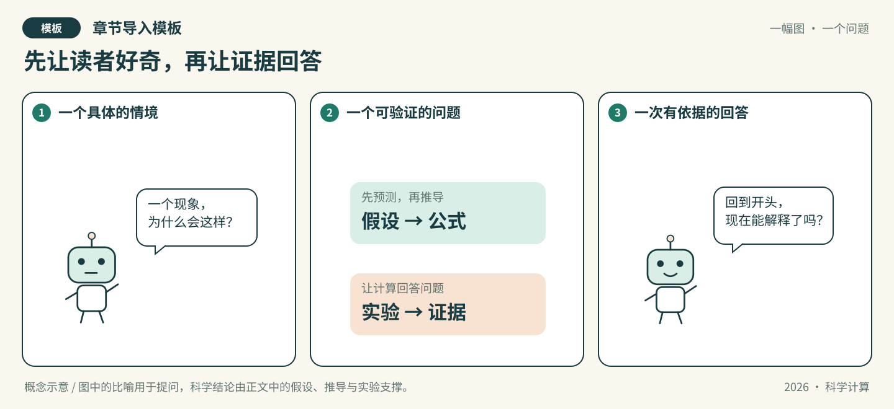

# 第XX章：有趣但贴切的标题

*导入插图模板，概念示意，非实测结果。复制到章节后按模板说明调整图片路径。*

> 通用备用模板，待填写。现有八章已经分别细化，优先使用各章A组-正文.md和A组-实验.ipynb。

**知识主题：** 【待填写】。

**本章核心问题：** 【待填写】。

**三个核心概念：** 【待填写】。

**先修知识：** 【待填写】。

**学时：** 4节×2学时=8学时。以下是通用占位结构，八章的具体节名以课程规划为准。

## 先看一幕

【待填写】用80—150字讲一个贴合本章的情境，保留一两句有趣对白。

**先猜，再验证：** 【待填写】有明确参数和判断依据的问题。

**把故事翻译成数学：** 【待填写】比喻对应的数学对象与适用边界，不能把图意当证明。

| 节 | 通用内容位置 | 学时 |
| --- | --- | --- |
| X.1 | 问题引入与核心概念 | 2 |
| X.2 | 方法一 | 2 |
| X.3 | 方法二 | 2 |
| X.4 | AI关联与实验 | 2 |

## X.1 问题引入与核心概念（2学时）

**填写方向：** 用具体情境提出核心问题，定义关键对象、符号与假设。

### 概念讲解
【待填写】本节目标、定义、假设、直观解释与一个自己的例子。

### 关键推导
【待填写】已知条件、逐步推导、结论、来源及条件不满足时的限制。

### 实验设计
【待填写】问题与运行前预测、输入和数据来源、独立参考、误差指标及容差理由、环境与预算。

### 代码与结果解释
【待填写】在Notebook同号小节实现并运行；写出实际结果、图表、误差及与预测的比较。未运行就标明未运行，不能用占位单元执行成功代替实验。

### 易错点与随堂讨论
【待填写】一条常见误解，使用手算、反例或真实结果说明；给出一问及解释。

## X.2 方法一（2学时）

**填写方向：** 说明第一种方法的思路、推导、实现与适用范围。

### 概念讲解
【待填写】本节目标、定义、假设、直观解释与一个自己的例子。

### 关键推导
【待填写】已知条件、逐步推导、结论、来源及条件不满足时的限制。

### 实验设计
【待填写】问题与运行前预测、输入和数据来源、独立参考、误差指标及容差理由、环境与预算。

### 代码与结果解释
【待填写】在Notebook同号小节实现并运行；写出实际结果、图表、误差及与预测的比较。未运行就标明未运行，不能用占位单元执行成功代替实验。

### 易错点与随堂讨论
【待填写】一条常见误解，使用手算、反例或真实结果说明；给出一问及解释。

## X.3 方法二（2学时）

**填写方向：** 解释第二种方法与第一种方法的关系，选择公平的比较条件。

### 概念讲解
【待填写】本节目标、定义、假设、直观解释与一个自己的例子。

### 关键推导
【待填写】已知条件、逐步推导、结论、来源及条件不满足时的限制。

### 实验设计
【待填写】问题与运行前预测、输入和数据来源、独立参考、误差指标及容差理由、环境与预算。

### 代码与结果解释
【待填写】在Notebook同号小节实现并运行；写出实际结果、图表、误差及与预测的比较。未运行就标明未运行，不能用占位单元执行成功代替实验。

### 易错点与随堂讨论
【待填写】一条常见误解，使用手算、反例或真实结果说明；给出一问及解释。

## X.4 AI关联与实验（2学时）

**填写方向：** 说明AI与本章核心概念的联系，用小实验核验一项具体主张。

### 概念讲解
【待填写】本节目标、定义、假设、直观解释与一个自己的例子。

### 关键推导
【待填写】已知条件、逐步推导、结论、来源及条件不满足时的限制。

### 实验设计
【待填写】问题与运行前预测、输入和数据来源、独立参考、误差指标及容差理由、环境与预算。

### 代码与结果解释
【待填写】在Notebook同号小节实现并运行；写出实际结果、图表、误差及与预测的比较。未运行就标明未运行，不能用占位单元执行成功代替实验。

### 易错点与随堂讨论
【待填写】一条常见误解，使用手算、反例或真实结果说明；给出一问及解释。

## 回到开场问题

【待填写】用推导和真实实验回答原先的问题，说明适用条件、比喻边界及尚未验证的部分。

## 本章小结与习题

【待填写】按三个核心概念总结。四节各对应一题，写入本章A组-习题.md；解答放在A组-习题参考解答.md，概念/推导、数值实现与陷阱辨析均需覆盖。

## 选读边界

【待填写】移出8学时主线的内容及已有的选读入口，不把所有相关方法都列成必做。

## 参考资料、图片来源与AI使用

【待填写】作者、标题、版本/年份、页码/章节、链接和支撑的主张。区分插图示意与实测图；记录图片来源、修改及授权依据。

AI辅助图文和代码记录到本章对应角色的AI对话文件，人工核验写进对应报告。模板图由仓库助手绘制，复制方法见模板目录README.md。
